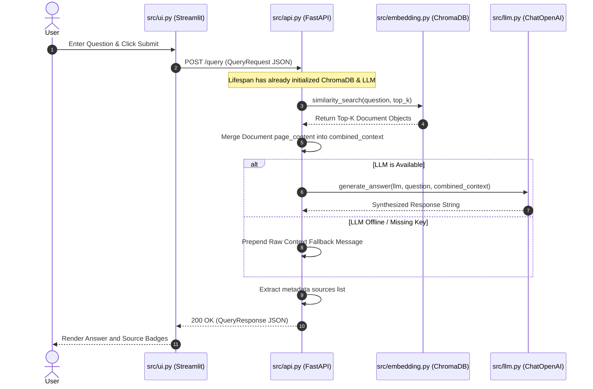

# Low-Level Design (LLD) & Exhaustive Code Map Document

**Project:** FinanceRAG / MedTech-RAG  
**Workspace:** `d:\FinanceRAG`  
**Document Purpose:** Provide a complete, exhaustive low-level design specification, module control flow maps, class/function definitions, logic branching, and visual Mermaid flowcharts across the entire codebase without needing raw source code.

---

## 1. High-Level Architecture & End-to-End Data Flow

```mermaid
flowchart TD
    subgraph Data Ingestion & ETL Pipeline
        A1[Input PDF Document] -->|Async Upload| B1[src/ingestion.py]
        B1 -->|LlamaCloud Agentic Parser| C1[Raw Markdown + Tables + Screenshots]
        C1 -->|Noise Clean & Heuristic Filtering| D1[src/preprocessing.py]
        D1 -->|Clean Markdown & Formatted Markdown Tables| E1[src/chunking.py]
        E1 -->|Semantic & Recursive Splitting| F1[Text & Table Chunks]
        F1 -->|SHA-256 Hashing & Embeddings| G1[src/embedding.py]
        G1 -->|Persist Embeddings| H1[(Chroma Vector DB)]
    end

    subgraph Runtime Inference & Query Pipeline
        U1[User Interface src/ui.py] -->|HTTP POST Request| P1[FastAPI Server src/api.py]
        P1 -->|Read Query Request| P2{Vector Store Online?}
        P2 -->|Yes| V1[ChromaDB Similarity Search k=4]
        V1 -->|Retrieved Context Docs| P3{LLM Loaded?}
        P3 -->|Yes| L1[src/llm.py: OpenAI / Anthropic / Gemini]
        P3 -->|No / Offline| F2[Raw Extracted Context Fallback]
        L1 --> R1[Synthesized Answer + Sources Metadata]
        F2 --> R1
        R1 -->|HTTP Response| U1
    end
```



---

## 2. Directory & Component Structure Map

```text
d:\FinanceRAG\
├── data\
│   ├── chroma_db\            # Persistent Chroma Vector Store
│   └── parsed_output\        # Intermediate ETL outputs (fulltext, clean text, tables, chunks)
├── src\ 
│   ├── api.py                # FastAPI REST server & lifespan manager
│   ├── chunking.py           # Text & Markdown table semantic splitters
│   ├── debug_pipeline.py     # End-to-end local validation script
│   ├── embedding.py          # Embedding model & vector store factories + hash ID builder
│   ├── evaluate.py           # Evaluation framework (RAGAS / precision metrics)
│   ├── ingestion.py          # Multimodal PDF parsing via LlamaCloud & screenshot downloader
│   ├── llm.py                # LLM model factory (OpenAI, Anthropic, Google) & generation engine
│   ├── preprocessing.py      # Regex cleaning, forward-filling tables, noise discard heuristics
│   ├── schemas.py            # Pydantic data contracts (QueryRequest, QueryResponse)
│   └── ui.py                 # Streamlit graphical interface
└── LOW_LEVEL_DESIGN.md       # This Low-Level Design Document
```

---

## 3. End-to-End Sequence Diagram (Client Query Request)



---

## 4. Script-by-Script Detailed Technical Specification

---

### Module 1: `src/api.py` (FastAPI Web Service Layer)
* **File Path:** [api.py](file:///d:/FinanceRAG/src/api.py)
* **Purpose:** Serves as the web application interface backend exposing REST endpoints for RAG execution.

#### Global State
* `vector_store`: Loaded ChromaDB vector database instance.
* `llm`: Initialized LangChain LLM instance (`None` if key missing/offline).

#### Functions & Handlers
1. **`lifespan(app: FastAPI)`** (`@asynccontextmanager`)
   * **Purpose:** One-time startup initializer and shutdown manager.
   * **Control Flow:**
     1. Loads `.env` variables.
     2. Reads `EMBEDDING_MODEL` environment variable (default: `"huggingface"`).
     3. Calls `get_embedding_model(...)` and `get_vector_store("chroma", embeddings)`.
     4. Attempts to load LLM via `get_llm("openai")`.
     5. **Try-Except Catch:** If LLM initialization fails (missing key/package), logs warning and sets `llm = None` (enabling graceful context-only fallback mode).
     6. Yields control to FastAPI server runtime.
     7. On shutdown, prints cleanup logs.

2. **`home()`** (`@app.get("/")`)
   * **Returns:** `{"message": "MedTech RAG is alive!"}`

3. **`get_status()`** (`@app.get("/status")`)
   * **Returns:** `{"status": "online", "pipeline": "chromadb_connected"}`

4. **`query_rag(request: QueryRequest)`** (`@app.post("/query")`)
   * **Input:** Pydantic object `QueryRequest(question, top_k)`
   * **Output:** Pydantic object `QueryResponse(answer, sources)`
   * **Decision Tree:**
     ```mermaid
     flowchart TD
         A[Receive QueryRequest] --> B[Perform similarity_search on vector_store]
         B --> C[Combine doc page_contents into combined_context]
         C --> D{Is global llm active?}
         D -->|Yes| E[Call generate_answer llm, question, context]
         D -->|No| F[Format fallback raw context string]
         E --> G[Extract sources from doc metadata]
         F --> G
         G --> H[Return QueryResponse dict]
     ```

---

### Module 2: `src/ingestion.py` (PDF Parsing & Multimodal Data Extraction)
* **File Path:** [ingestion.py](file:///d:/FinanceRAG/src/ingestion.py)
* **Purpose:** Uploads raw PDF manuals to LlamaCloud API, parses unstructured text, extracts Markdown tables, and downloads page-level screenshots.

#### Functions & Handlers
1. **`is_page_screenshot(image_name: str) -> bool`**
   * **Logic:** Evaluates regex pattern `^page_(\d+)\.jpg$` against filename to isolate page screenshots from embedded logo/asset images.

2. **`main()`** (Async Event Loop Entrypoint)
   * **Control Logic:**
     1. Reads `llamacloud_key` from environment. If missing $\rightarrow$ aborts.
     2. Ensures `./data/screenshots/` and `./data/parsed_output/` directories exist.
     3. Uploads input PDF file (`Allengers_100.pdf`) via `client.files.create(purpose="parse")`.
     4. Invokes `client.parsing.parse()` with options: `tier="agentic"`, `ignore_diagonal_text=True`, `ocr_languages=["en"]`.
     5. **Table Extraction Loop:** Iterates through `result.items.pages` items. Converts table row objects into JSON-serializable dictionaries with page numbers.
     6. **Image Download Loop:** Iterates through presigned image URLs. Filters via `is_page_screenshot()`, skips duplicates using a set, and streams image files via `httpx.AsyncClient`.
     7. **File Savings:**
        * `data/parsed_output/fulltext.txt`: Joined plain text pages.
        * `data/parsed_output/full_markdown.md`: Joined raw markdown.
        * `data/parsed_output/tables.json`: Structured array of table rows.

---

### Module 3: `src/preprocessing.py` (Text Cleaning, Table Recovery & Filtering)
* **File Path:** [preprocessing.py](file:///d:/FinanceRAG/src/preprocessing.py)
* **Purpose:** Removes repetitive headers/footers, strips inline HTML, cleans noisy diagram blocks, and forward-fills missing cells in extracted Markdown tables.

#### Constants & Configuration
* `EXCLUDE_PAGES`: `{11, 32}` (Excludes pages with circuit schematics/diagrams).

#### Functions & Handlers
1. **`clean_text(text: str, tables_data: List[dict]) -> str`**
   * **Cleaning Logic:**
     * Removes `<table>...</table>` blocks to prevent duplicated data.
     * Uses regex to strip repeated document titles ("Allengers 100 Installation/Service Manual", "Page X", "AN ISO 9001 COMPANY").
     * Normalizes `\n{3,}` down to `\n\n`.
     * Crops pre-chapter content by splitting at `# 1. SYSTEM OVERVIEW`.
     * **Heuristic Block Filter:** Splits text into blocks by `\n\n`. Discards blocks if:
       * Alphabetical character ratio $< 0.5$, OR
       * Alphabetical ratio $< 0.65$ AND average line length $< 15$ chars (removes broken OCR diagrams).
       * Block contains $\ge 3$ string matches from extracted tables (removes inline duplicate tables).

2. **`forward_fill_page_12(rows: List[list]) -> List[list]`**
   * **Domain Logic:** Fixes specific Page 12 Fuses Table issue where multi-fuse locations are omitted in subsequent rows. Remembers `last_location` and appends it to rows missing column 4.

3. **`make_markdown_table(rows: List[list]) -> str`**
   * **Logic:** Takes 2D array of rows. Generates valid Markdown table string (`| col1 | col2 |`) with header separators (`|---|---|`). Replaces internal cell newlines (`\n`, `<br/>`) with spaces.

4. **`process_tables(tables_data: List[dict]) -> str`**
   * **Control Loop:** Skips pages in `EXCLUDE_PAGES`. Applies `forward_fill_page_12` for Page 12. Formats all valid tables using `make_markdown_table` and appends `### Data Table - Source: Page X` header.

5. **`main()`**
   * Loads `full_markdown.md` and `tables.json`, executes `clean_text()` and `process_tables()`, and writes:
     * `data/parsed_output/clean_markdown.md`
     * `data/parsed_output/processed_tables.md`

---

### Module 4: `src/chunking.py` (Semantic & Hybrid Chunking Pipeline)
* **File Path:** [chunking.py](file:///d:/FinanceRAG/src/chunking.py)
* **Purpose:** Splits text and table data into optimal chunk sizes for embedding without breaking section context or splitting tables across rows.

#### Functions & Handlers
1. **`chunk_text() -> List[Document]`**
   * **Two-Pass Splitting:**
     * **Pass 1:** Uses `MarkdownHeaderTextSplitter` splitting on `#`, `##`, `###` headers to preserve section titles.
     * **Pass 2:** Passes header-split sections into `RecursiveCharacterTextSplitter` (`chunk_size=1000`, `chunk_overlap=200`).
   * **Returns:** List of LangChain `Document` objects.

2. **`chunk_tables() -> List[str]`**
   * **Logic:** Reads `processed_tables.md`. Splits text strictly by `"### Data Table - Source: Page "`.
   * Re-attaches metadata header to each chunk. Ensures every markdown table is treated as a single, atomic chunk (never sliced in half).

3. **`main()`**
   * Calls `chunk_text()` and `chunk_tables()`. Merges and writes a complete inspection report to `data/parsed_output/chunks/all_chunks.txt`.

---

### Module 5: `src/embedding.py` (Vector Embedding & Database Storage)
* **File Path:** [embedding.py](file:///d:/FinanceRAG/src/embedding.py)
* **Purpose:** Manages embedding models, generates deterministic document IDs to prevent vector duplicates, and persists chunks into ChromaDB.

#### Factory Functions
1. **`get_embedding_model(model_choice: str)`**
   * **Choices:**
     * `"huggingface"` $\rightarrow$ `HuggingFaceEmbeddings(model_name="all-MiniLM-L6-v2")`
     * `"openai"` $\rightarrow$ `OpenAIEmbeddings(model="text-embedding-3-small")`
     * `Other` $\rightarrow$ Raises `ValueError`.

2. **`get_vector_store(store_choice: str, embeddings_model)`**
   * **Choices:**
     * `"chroma"` $\rightarrow$ `Chroma(persist_directory="./data/chroma_db", embedding_function=embeddings_model)`
     * `"pinecone"` $\rightarrow$ Raises `NotImplementedError` (Placeholder for V2).

3. **`_generate_doc_id(content: str, source: str, index: int) -> str`**
   * **Deduplication Hashing:** Computes SHA-256 hash of `f"{source}:{index}:{content}"` and returns first 16 characters. Guarantees deterministic upserts in ChromaDB.

4. **`main(args)`**
   * **CLI Flags:** `--model` (default: huggingface), `--store` (default: chroma), `--reset` (wipes existing ChromaDB directory).
   * **Workflow:**
     1. Fetches chunks via `chunking.chunk_text()` and `chunking.chunk_tables()`.
     2. Wraps text & table chunks into LangChain `Document` instances with metadata (`source`, `chunk_index`, `page`).
     3. Computes unique hash IDs for each document.
     4. Initializes embedding model and ChromaDB store.
     5. Calls `vector_store.add_documents(documents, ids=doc_ids)`.

---

### Module 6: `src/llm.py` (LLM Generation Factory & Synthesis Engine)
* **File Path:** [llm.py](file:///d:/FinanceRAG/src/llm.py)
* **Purpose:** Factory function for instantiating multi-provider LLMs and executing prompt-guided synthesis.

#### Functions & Handlers
1. **`get_llm(model_choice: str)`**
   * **Branching Model Loader:**
     * `"openai"` $\rightarrow$ `ChatOpenAI(model="gpt-4o-mini", temperature=0)`
     * `"anthropic"` $\rightarrow$ `ChatAnthropic(model="claude-3-haiku-20240307", temperature=0)`
     * `"google"` $\rightarrow$ `ChatGoogleGenerativeAI(model="gemini-1.5-flash", temperature=0)`
     * `"local"` $\rightarrow$ Raises `NotImplementedError`.

2. **`generate_answer(llm, question: str, context: str) -> str`**
   * Builds system prompt instructing the LLM to strictly base its answer on provided context and avoid hallucination.
   * Sends `[SystemMessage, HumanMessage]` to LLM via `llm.invoke()` and returns output text.

---

### Module 7: `src/schemas.py` (API Schemas)
* **File Path:** [schemas.py](file:///d:/FinanceRAG/src/schemas.py)
* **Purpose:** Enforces input request and output response type signatures for FastAPI endpoints.

```python
from pydantic import BaseModel
from typing import List

class QueryRequest(BaseModel):
    question: str
    top_k: int = 4

class QueryResponse(BaseModel):
    answer: str
    sources: List[str]
```

---

## 5. Summary of Data Structures & Controls

| Component | Input Format | Output Format | Error / Fallback Strategy |
| :--- | :--- | :--- | :--- |
| **Ingestion (`ingestion.py`)** | PDF File (`.pdf`) | Markdown, JSON Tables, JPG Screenshots | Checks for missing API key/file, exits cleanly |
| **Preprocessing (`preprocessing.py`)** | Raw Markdown & JSON | `clean_markdown.md`, `processed_tables.md` | Heuristic discard of low-alpha ratio blocks |
| **Chunking (`chunking.py`)** | Clean Markdown & Formatted Tables | List of `Document` chunks & string table chunks | Header splitting with recursive fallback |
| **Embedding (`embedding.py`)** | Document Chunks | Vector Store in ChromaDB | SHA-256 hash IDs prevent duplicate insertion |
| **API (`api.py`)** | `QueryRequest` (JSON) | `QueryResponse` (JSON) | If LLM offline, returns raw context fallback |

---
*Document generated automatically for workspace `d:\FinanceRAG`.*
