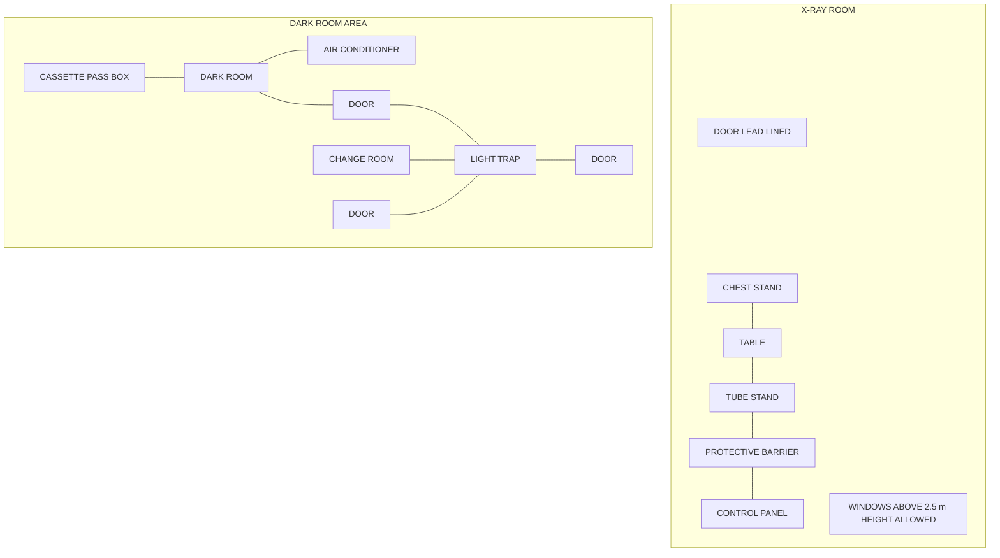
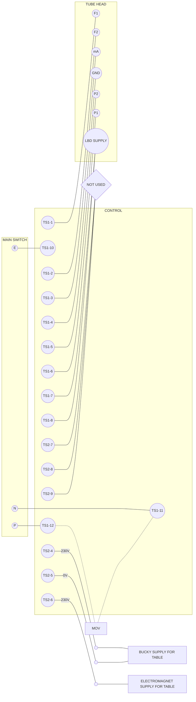

# Allengers-100
## (X-RAY GENERATOR)

The image shows the control panel of the Allengers-100 X-Ray Generator. The digital display indicates:
- **BODY PART:** LOWER-EXT
- **SIZE:** BABY
- **VIEW:** AP
- **KV:** 040
- **mAs:** 002
- **mA:** 50 L K4 VER

The control panel features various buttons for APR, Body Part selection, Size, View, KV adjustment, mAs adjustment, mA selection, Power (On/Off), and Exposure.

# INSTALLATION/SERVICE MANUAL

**Allengers MEDICAL SYSTEMS LTD.**
S.C.O. 212-214, SEC. 34-A,
CHANDIGARH (INDIA)
TEL.: +91-172-3012287, 3012285
FAX: +91-172-2621912
E-mail: exports@allengers.net
Website: www.allengers.com

**Our EU Authorised Representative:-**
JMC Medical Sprl,
58, Avenue du Parc de Woluwe
B-1160 Bruxelles
Belgium
Tel: +32.2.672.56.44
Fax: +32.2.662.29.92
E-mail: jmc@beon.be

### *We Aim For Your Delight*

# PREFACE

This Installation and Service Manual of Allengers 100 X-Ray Machine covers all aspects of Installation and Servicing of the Machine.

The Manual covers the Installation Procedure & checkpoints, Circuit Diagram, its Explanation, Calibration Procedure, Trouble Shooting and major parts list.

Although all efforts have been made to keep this Manual simple to understand, in case of any clarification, Allengers International Customer Care Cell can be contacted for more detailed information on any aspect.

It is assumed that anyone referring to this manual and attempting to service the X-Ray Machine has relevant Technical background and Training to service this Equipment.

This Manual is company's confidential document and is meant to be circulated only to company's Service Engineers and authorized Service Dealers.

Photocopying and free circulation of this document is prohibited.

# CONTENTS

**1. System Overview.................................................................................................. 1**

    1.1 Introduction.................................................................................................. 1
    1.2 Technical Specifications............................................................................... 3
    1.3 Description of Control.................................................................................. 4
    1.4 Description of Control Keys......................................................................... 5
    1.5 Power Supply Requirements........................................................................ 8
    1.6 Environmental Conditions............................................................................ 8

**2. Unpacking Instructions......................................................................................... 9**

**3. Infrastructural Requirements for Installation...................................................... 10**

    3.1 Supply and Wiring Requirements................................................................ 10
    3.2 Earthing Requirement.................................................................................. 10
    3.3 Suggested Room Plan.................................................................................. 11
    3.4 Air Conditioning.......................................................................................... 14
    3.5 Room Layout Approval from Regulatory Board......................................... 14

**4. Installation Procedure........................................................................................... 15**

    4.1 Assembly Procedure.................................................................................... 15
    4.4 Installation Check-points............................................................................. 22
    4.3 Inter Connections of Various Assemblies.................................................... 23
    4.4 Assembly Procedure.................................................................................... 24
    4.5 Procedure for Voltage Adjustment............................................................... 25
    4.6 Installation Check-points............................................................................. 26

**5 Circuit Diagram** .................................................................................................................... **27**

**6. Circuit Explanation**.............................................................................................................. **28**

**7. Calibration & Testing**........................................................................................................... **29**

* 7.1 Energizing the Equipment.......................................................................................... 29
* 7.2 Carrying out Preliminary Tests................................................................................... 29
* 7.3 Calibrating the Equipment.......................................................................................... 30
* 7.4 Procedure for carrying out QA Tests as per BARC/AERB......................................... 34

**8. Troubleshooting**.................................................................................................................. **35**

**9. Post Installation Instructions**.............................................................................................. **39**

**10. Dark Room Procedures & X-Ray Film Processing**......................................................... **40**

**11. Radiation Monitoring & Protection**.................................................................................. **41**

**12. Preventive Maintenance Procedure**.................................................................................. **42**

**13. Preventive Maintenance Check Points**............................................................................. **43**

Checked By____________________

This Machine is type approved for Mechanical, Electrical & Radiation Safety Standards by following regulatory boards:

# PRODUCT APPROVAL

*   **Approved for meeting Radiation Safety Standards by Atomic Energy Regulatory Board (AERB)**
*   **Approved for Mechanical & Electrical Safety Standards by Bureau of Indian Standards (BIS).**
*   **CE Certified; Approved for meeting International Safety Standards**

# SYSTEM CERTIFICATE

*   **ISO 9001:2008 & ISO 13485:2003 Approved for meeting Quality Management System Requirements.**

# 1. SYSTEM OVERVIEW

## 1.1 INTRODUCTION

The Radiography **Parameters** defined in this machine are based on **Human Anatomy**. This is reason why this machine is known as **APR** (Anatomical Programmed Radiography Machine).

There are different keys to define the Body Part to be exposed and depending on the defined Part by operator, machine it-self set the parameters depending on the built of patient and Screen Speed combination available for Exposure.

Operator can choose manual mode and can select their own parameters for exposures.

Allengers 100 is a Diagnostic X-Ray generator, which caters to the general requirements of Radiography. This generator is also available in other options like Fluoroscopy and Spot Filming. This equipment can be used with following combinations of stands and tables:

**<u>STANDS:</u>**

Counter balanced mobile stand (CBM)- Incase of Machines with Radiography only

Allengers 100 X-Ray generator is ideally suited for Chest/ Extremities/ Skull/ Abdomen and other routine examinations.

This unit incorporates State - of - the- Art technology and is designed keeping in mind the diverse requirements of the Radiologists. It is a Full Wave Rectified Unit (Two Pulse) and consists of Control Panel & Self contained Tube Head Unit with manual collimator.

This machine is Type Approved for Electrical, Mechanical and Radiation Safety Standards (vide IS: 7620) from the Atomic Energy Regulatory Board (AERB), Govt. of India, thus making it entirely safe from the Radiation Hazards.

**The System consists of the following:**

1. Column Cover
2. Column
3. Pin for Vertical Carriage
4. Tube Head
5. Tube Head Hanger
6. Tube Head Rotational Lock
7. Vertical Carriage Locking Knob
8. LBD (Collimator)
9. Compensator Switch & MCB
10. Control
11. E Ring for Foot Lock Rod
12. Base
13. Foot Lock for Machine movement
14. Control Handle
15. Panel
16. Hand Switch
17. Fuses, Main Supply, Ext. Cord, Bucky & Tube Head Connections
18. Digital Voltmeter
19. Tube Head Rotational Knob
20. Vertical Carriage

The image shows a mobile X-ray unit with numbered callouts corresponding to the list above:
- **1** points to the top cap of the vertical column.
- **2** points to the main vertical column.
- **3** points to a pin assembly at the top of the carriage.
- **4** points to the X-ray tube head.
- **5** points to the hanger supporting the tube head.
- **6** points to the lock for tube head rotation.
- **7** points to a knob on the carriage assembly.
- **8** points to the collimator (LBD) at the bottom of the tube head.
- **9** points to the rear side of the main control body.
- **10** points to the main control cabinet.
- **11** points to the base near the front wheel axle.
- **12** points to the lower base frame.
- **13** points to the foot pedal at the rear.
- **14** points to the handles for maneuvering the unit.
- **15** points to the operator control panel.
- **16** points to the hand-held exposure switch.
- **17** points to the connection panel at the rear top.
- **18** points to a digital display on the top surface.
- **19** points to a knob on the side of the tube head assembly.
- **20** points to the vertical carriage that moves along the column.

## 1.2 TECHNICAL SPECIFICATIONS

<table>
  <tbody>
    <tr>
        <td>ALLENGERS-100 (APR LCD)</td>
        <td>100mA, Full Wave Rectified X-Ray Generator with Stationary Anode X-Ray Tube and LCD Display **Anatomical Programmed Radiography (APR):** For quick and fine selection of radiographic parameters for optimum image quality.</td>
    </tr>
    <tr>
        <td>OUTPUT</td>
        <td>8.0 KW</td>
    </tr>
    <tr>
        <td>mA STATIONS</td>
        <td>100 mA, 50 mA and 25 mA</td>
    </tr>
    <tr>
        <td>KVP RANGE</td>
        <td>40 to 100KVP in Steps of 1 KVP/Step.</td>
    </tr>
    <tr>
        <td>TIMER</td>
        <td>Controller based electronic timer having range from 0.01 to 8.0 sec in 21 steps.</td>
    </tr>
    <tr>
        <td>CONTROL</td>
        <td>* **Anatomical Programmed Radiography** helps the operator in such a way that by just selecting the Patient Size and Body Part to be X-Rayed the KVP and mAs are automatically selected * Attractive and Ergonomically designed feather Touch Panel **control panel having LCD display** which displays the parameters like mA, mAs, KVP, Screen type, Bucky selection, selected body part description. * Laminated Membrane switches are provided for mA Selection, KVP Selection, mAs selection, Ready, X-Ray S/W, Bucky Selection S/W and M/C ON-OFF S/Ws. * Provided with a voltage compensator switch for adjusting the I/P voltage of machine to 230V. Adjustment can be made in the range 190V to 260V &amp; for this a Digital voltmeter is provided to display the input voltage. * A Booster X-mer is provided to stabilize and maintain the filament voltage. * A hand S/W with five meter length retractable cord is provided for operating the equipment from distance position.</td>
    </tr>
    <tr>
        <td>OVERLOAD PROTECTION &amp; SAFETY FEATURES</td>
        <td>* Automatic trip off overload Circuit Breaker * Ready &amp; X-Ray indicators * Fuses for all circuits are provided in the machine * Electronic overload system does not allow Machine to select parameters which are out of range according to X-ray tube rating chart</td>
    </tr>
    <tr>
        <td>TUBE HEAD</td>
        <td>Self-contained Tube Head containing Stationary Anode X-Ray Tube, Compact Heavy Duty Full Wave Rectified H.T. Transformer and High Voltage Silicon Rectifiers etc. all oil immersed and hermetically sealed. Tube head can be tilted 360 Degree with full flexibility for use in operation theatres and in ward for bed-side radiography. A multi-leaf collimator is provided</td>
    </tr>
    <tr>
        <td>POWER REQUIREMENT</td>
        <td>230 Volts, Single Phase, AC supply. Max. Allowable Line Regulation ± 10%. (with line resistance less than 0.4 ohm.)</td>
    </tr>
  </tbody>
</table>

## 1.3 DESCRIPTION OF CONTROL

Operator Console of Allengers-100 consists of following keys as shown:

The image shows the operator console of the Allengers-100 X-ray system with various controls and a digital display. The components are labeled with letters and numbers as follows:

*   **C (Display Screen):** A blue backlit LCD showing:
    *   Top row: `BODY PART: LOWER-EXT`, `SIZE: BABY`, `VIEW: AP`
    *   Bottom row: `040` (KV), `002` (mAs), `50 L K4 VER` (mA and other status indicators)
*   **A:** Small circular button with a toggle icon.
*   **B:** Small circular button with a speaker/mute icon.
*   **11:** Button with a person-lying-down icon.
*   **12:** `APR` button.
*   **13:** `BODY PART` selection buttons (Up/Down arrows).
*   **VIEW:** Button for view selection.
*   **SIZE:** Button for patient size selection.
*   **10:** Circular button (unlabeled).
*   **9:** Circular button (unlabeled).
*   **8:** `KV` adjustment buttons (Up/Down arrows).
*   **7:** `mAs` adjustment buttons (Up/Down arrows).
*   **6:** Button with a grid icon.
*   **5:** `mA` selection button.
*   **POWER Section:**
    *   **1:** Power ON button (I).
    *   **2:** Power OFF button (O).
*   **D Section:**
    *   Circular button with a circle icon.
    *   Circular button with a radiation warning/head icon.
*   **EXPOSURE Section:**
    *   **3:** Preparation button (circular icon).
    *   **4:** Exposure button (radiation symbol icon).

## 1.4 DESCRIPTION OF CONTROL KEYS

**1. MACHINE ON SWITCH** (Icon: Vertical line inside a circle)

This switch is used to turn ON the machine.

**2. MACHINE OFF SWITCH** (Icon: Circle)

This switch is used to turn OFF the machine. Indicator along this switch glows when power is available to the machine but machine is in OFF condition.

**3. READY SWITCH** (Icon: Circular button with a power-like symbol)

This switch is used to Boost the Filament.

**4. EXPOSURE SWITCH** (Icon: Circular button with a radiation symbol)

This switch is used to make an Exposure. For exposure, first press the Ready Switch and then Exposure Switch Simultaneously

**5. mA SELECTION SWITCH** (Icon: Circular button labeled "mA")

This Switch is used to select the mA. By pressing this switch mA station will be changed.

**6. BUCKY SWITCH** (Icon: Circular button with a grid pattern)

This switch is used to energize the Horizontal or Vertical Bucky.

**7. mAS INCREASE & DECREASE SWITCHS** (Icon: Up arrow, "mAs" label, Down arrow)

These switches are used to Increase / Decrease the mAs. mAs can be Increased or Decrease from 1 to 200 mAs.

**Note: - kV and mAs Increase Decrease switch does not work in the APR Mode.**

**8. kV INCREASE & DECREASE SWITCH** (Icon: Up arrow, "KV" label, Down arrow)

This switch is used to Increase / Decrease KV. KV can be Increased or Decrease from 40 to 100 KV in steps of 1 KV each and the display of KV is shown on the display above these switches.

### 9. PATIENT SIZE SELECTION SWITCH
The image shows a circular button labeled "SIZE".

This switch is used to select the body size of the patient i.e. LARGE/MEDIUM/SMALL/BABY

### 10. AP/LAT/OBL
The image shows a circular button labeled "VIEW".

This switch is used to change the view of patient body part to be exposed.

### 11. DENSITY SWITCH
The image shows a circular button with a density/speed icon.

This switch is used to select the screen speed combinations like 200 speed/400 speed/800 speed.

### 12. APR
The image shows a circular button labeled "APR".

When we switch ON the machine then by default machine is in the APR Mode. By pressing this switch the machine will switch to Manual Mode from APR Mode.

### 13. BODY PART SELECTION SWITCHES
The image shows two circular buttons with up and down arrows, labeled "BODY PART".

These switches are used to select the Body Area of which X-Ray is to be taken i.e. Lower-EXT, Hand, Pelvis & Spine, Abdomen, DOR-Spine, Chest, Shoulder, CEP-Spine, Skull.

### A) THIS SWITCH IS NOT USD IN THIS MACHINE
The image shows a circular button with a bucky/grid icon that is crossed out.

### B) THIS SWITCH IS NOT USD IN THIS MACHINE
The image shows a circular button with a speaker/mute icon that is crossed out.

### C) DISPLAY
The image shows a digital LCD display screen with the following information:

<table>
  <thead>
    <tr>
        <th>BODY PART</th>
        <th>SIZE</th>
        <th>VIEW</th>
        <th colspan="3"></th>
    </tr>
  </thead>
  <tbody>
    <tr>
        <td>LOWER-EXT</td>
        <td>BABY</td>
        <td>AP</td>
        <td colspan="3"></td>
    </tr>
    <tr>
        <th>KV</th>
        <th>mAS</th>
        <th>mA</th>
        <th>[Icon]</th>
        <th>[Icon]</th>
        <th>[Icon]</th>
    </tr>
    <tr>
        <td>040</td>
        <td>002</td>
        <td>50</td>
        <td>L</td>
        <td>K4</td>
        <td>OFF</td>
    </tr>
  </tbody>
</table>

### D) READY/EXPOSURE INDICATOR

The image shows a circular indicator panel with two LED lights. The top light is labeled "Ready" and the bottom light is labeled "Exposure".

When we press ready switch from Panel or Hand Switch ready indicator (green) is glowing and when Exposure switch is pressed Exposure indicator (yellow) is glowing.

### E) DIGITAL PANEL VOLTMETER

The image shows a digital display showing the number "230" in red segments.

This meter is used to show the machine Input Supply.

### F) COMPENSATOR SWITCH (ON BACKSIDE OF CONTROL)

The image shows a rotary dial labeled "V.C. COARSE" with multiple position markings.

The Compensator switch is provided at the back side of control which is having 12 Steps and is used to adjust large variations in incoming voltage from 190V to 260V.

### G) HAND SWITCH (MOUNTED ON CONTROL PANEL)

The image shows a white handheld trigger switch. The first stage of the button is labeled "Ready" and the fully depressed stage is labeled "Exposure".

This is two-position switch. When switch is pressed in first step, Ready function is activated and when this switch is pressed further, X-Ray functions is activated.

### FUSES FOR SAFETY:

<table>
  <thead>
    <tr>
        <th>Fuse No.</th>
        <th></th>
        <th>Function</th>
        <th></th>
        <th>Rating</th>
        <th></th>
        <th>Location</th>
        <th></th>
    </tr>
  </thead>
  <tbody>
    <tr>
        <td>F1</td>
        <td>Line Fuse</td>
        <td>25 Amps.</td>
        <td rowspan="4">On Rear of Control Panel</td>
        <td colspan="4"></td>
    </tr>
    <tr>
        <td>F2</td>
        <td>Filament Supply</td>
        <td>4 Amps.</td>
        <td colspan="4"></td>
    </tr>
    <tr>
        <td>F3</td>
        <td>Motherboard Card</td>
        <td>2 Amps.</td>
        <td colspan="4"></td>
    </tr>
    <tr>
        <td>F4</td>
        <td>Light Beam Diaphragm (Collimator) Fuse</td>
        <td>4 Amps.</td>
        <td colspan="4"></td>
    </tr>
  </tbody>
</table>

16 Amp MCB is provided for over current protection.

### LBD LIGHT ON SWITCH (ON LBD)

The image shows a round red push-button switch.

This is Push to ON type switch. When it is pressed bulb gets ON and remains ON for 1 minute. After 1 minute bulb gets OFF automatically.

## 1.5 POWER SUPPLY REQUIREMENTS

The electrical power requirements for Allengers 100 X-Ray system are as follows:

Input Voltage: Single Phase 230 V AC with regulation of $\pm$ 10 %
Input Frequency: 50/60 Hz.
Current Rating: 15 Amps.
Line Resistance: 0.4 Ohms as per IS 7620 (Part 1)

It must be ensured that at the power socket, the right pin of socket is connected to Phase (line) and left to the Neutral. Also, voltages between following points should be checked:

Phase & Neutral: 230 V AC
Neutral & Earth: 0 V AC
Phase & Earth: 230 V AC

### EARTHING:

**It is strongly recommended that independent earthing (at zero potential) is available in the power socket in the Room where the machine is to be used. Proper earthing not only enhances the performance & reliability of the equipment but increases safety for the operating staff as well.**

## 1.6 ENVIRONMENTAL CONDITIONS:

### **Storage**

Temperature: 0 to 40° C
Humidity: Maximum 90% at 30° C

### **Operating Conditions:**

Temperature: 10° to 40° C
Humidity: Upto 75%

# 2. UNPACKING INSTRUCTIONS

Optimum care is taken while packing the machine so that the machine must reach to the final destination without any scratches and must be free from any transportation damages. The machine is first packed in Polythene sheet & then further packing is done either using foam/thermocole sheet. The outer carton could be of cardboard box or wooden ply packing. The wooden boxes are packed with the nails and metallic strips wound with the nuts and bolts.

The Service Engineer should study the following safety points before installing the machine at the customer's place:

**!** Utmost care should be taken while unpacking the boxes.

*   Always make sure that while unpacking the boxes the items contained in them do not get damaged.
*   While removing the screws, bolts or nuts from the boxes, make sure that the instrument used for removing the screws, bolts or nuts do not penetrate in the box and subsequently damage the contents of the box.
*   Extra Care should be taken while opening the heavier items as any sort of carelessness can cause injury to the person handling the item.

Follow the procedure below to open the packing:

(i) Remove the metallic strips by opening the nuts and bolts with the spanners.
(ii) Remove the wooden packing from the sides by removing the nails. Care must be taken so that the contents of the box are not hit accidentally.
(iii) Remove the thermocole packed material from the cardboard boxes after removing the packing tapes used to close the boxes (wherever applicable) and then remove thermocole packing sheet and polythene sheet by removing packing tape.

The unpacked parts must not be kept on the floor and can be kept on the packing sheets removed earlier to avoid any scratches on the parts and to keep them clean. Do not touch the parts with dirty hands or rub them with a piece of cloth to avoid any dirt marks on the parts.

Check the contents of Packing as per Packing List along with the machine and report any damages or short shipments if any in prescribed format to Head Office.

# 3. INFRASTRUCTURAL REQUIREMENTS

## 3.1 SUPPLY AND WIRING REQUIREMENTS

**Input Supply:**

*   1 Phase 230 V AC $\pm$ 10%
*   50/60 Hz.
*   Line Resistance of 0.4 Ohms

**<u>Note:</u> The power line must not have a line resistance of more than 0.4 Ohms. In case the line resistance is more than 0.4 Ohms, the output of machine may be reduced.**

## 3.2 EARTHING REQUIREMENT

It is strongly recommended that independent earthing at zero potential is available at Mains switch in the X-Ray Room where machine is to be installed. Independent earthing not only enhances the performance and reliability of the equipment but it is also safe for the operating staff as well.

## 3.3 SUGGESTED ROOM PLAN (For Fixed Installations only)

OPEN AREA

**SIMPLEST LAYOUT OF X-RAY ROOM AND DARK ROOM**
**(FOR ROUTINE PROCEDURES IN A SMALL HOSPITAL)**

### 3.3.1 X-Ray Room Layout Requirements

1.  **Location of X-Ray Installation:**
    The room housing diagnostic X-Ray unit equipment should be located as far away as feasible from areas of high occupancy and general traffic, such as maternity and paediatric wards and other departments of the hospital that are not directly related to radiation and its use.

2.  **Layout:**
    The layout of room in X-ray department should aim at providing integrated facilities so that handling of X-ray equipment and related operations can be conveniently performed with adequate protection. The number of doors for entry to the X-ray room should be kept to the minimum. The doors and passages leading to the X-ray installation should permit safe and easy transport of equipment and non-ambulatory patients. The dark room should be so located that the primary X-ray beam cannot be directed on it.

3.  **Room Size:**
    The room housing an X-ray equipment must be spacious enough to permit installation, use and servicing of equipment with safety and convenience for he operating personnel, the servicing personnel and the patient. The room size must not be less than the 180 sq. ft. for a general purpose X-ray machine.

4.  **Shielding:**
    Appropriate structural shielding shall be provided for the walls, the ceiling and the floor of the X-ray room so that doses received by workers occupationally exposed to the radiation and the members of the public are kept to a minimum and shall not exceed the annual effective dose equivalent limits of 50 mSv and 1 mSv respectively. The doors of an X-ray room shall provide the same shielding as that of the adjacent walls incase persons are likely to be present in front of them when the X-ray unit is energized. Appropriate shielding must be provided for the dark room to ensure that undeveloped X-ray films stored in it will not be exposed to more than an air kerma rate of 10 $\mu$Gy per week (approximately 1.13 mR per week).

5.  **Openings and Ventilation:**
    Unshielded openings, if provided in an X-ray room for ventilation or natural light etc. must be located above a height of 2 meters from the ground/floor level outside the X-ray room.

### 6. Illumination Control:

Room housing fluoroscopy equipment must be so designed that adequate darkness can be achieved conveniently when desired in the room. A suitable red light must be provided in the room for the use of radiologist after dark adaptation.

### 7. Equipment Layout:

The X-ray equipment must be installed in such a way that in normal use the useful beam is not directed towards control panel, doors, windows or areas of high occupancy. The useful beam should preferably be directed towards unoccupied areas of high occupancy. Sufficient area should be left around the X-ray table for safe and free movement of equipment/trolley, radiology staff and service personnel.

### 8. Control:

In case of diagnostic X-ray equipment operating up to 100KV, the control must be installed in a separate control room located outside but contiguous to the X-ray room and provided with appropriate shielding, direct viewing and oral communication facilities between the operator and the patient.

### 9. Waiting Areas:

Patient waiting area must be provided outside the X-ray room.

### 10. Warning Light And Placard:

A suitable warning signal such as a red light must be provided at a conspicuous place outside the X-ray room and kept 'ON' when the X-ray unit is in use to prevent inadvertent entry of persons not connected with the examination. An appropriate warning placard must also be posted outside the X-ray room.

## 3.4 AIR CONDITIONING

Although it is not mandatory to use this equipment in air-conditioned environment but maintaining a room temperature in the range of 25 to 30° C helps in providing sufficient cooling to the unit and thus maintaining proper functioning and reliability of equipment.

## 3.5 ROOM LAYOUT APPROVAL FROM REGULATORY BOARD/BOARDS

**Note: PLEASE REFER TO YOUR COUNTRY'S RULES AND REGULATIONS AS APPLICABLE TO MEDICAL DIAGNOSTIC X-RAY EQUIPMENTS.**

We suggest you to strictly follow the safety standards as applicable in your country for safety from Electrical, Mechanical & Radiation related hazards.

No X-Ray unit shall be commissioned unless the layout of the proposed X-Ray installation is approved by the competent authority.

# 4. INSTALLATION PROCEDURE

## 4.1 ASSEMBLY PROCEDURE

1. Take the base of the mobile unit and place it on the floor. The base is provided with the four wheels, two fixed wheels on the front side and two rear wheels inside the base on its backside. The backside wheels are steering wheels for the base movement.

The image shows a top-down view of the mobile unit base. It is a white rectangular platform with wheels visible. There is a central square opening labeled "Square Grooves for Counter Weight" with an arrow pointing to the recessed area. At the bottom edge of the base, a pedal is labeled "Foot Lock" with an arrow.

2. Lock the base with the help of the mechanical foot operated break provided on the right hand side of the base (The position for locking and unlocking of the foot break is indicated near the break).

3. Open all the (12) screws fixed on the top of the base. Care must be taken that all the screws are kept on the safe place along with all the spring and the plane washers, as they will be required to fix different parts on the base.

4. Take the counter weight and clean this with a piece of cloth from all the sides and make sure that the rubber strips mounted on the top and bottom sides of the counter weight are extended a little out and the screws to fix these rubber strips are tightened properly (These rubber strips are fixed for the reason that when the weight moves inside the column, noise of the weight due to touching with internal sides of the column can be dampened). Take the steel ropes and fix one end of the steel ropes to the counter weight with the help of the spanner or the adjustable spanner tightly.

The image shows a close-up of the top of the counterweight. It is a dark, heavy metal block. Two steel wire ropes are attached to the top surface using large hexagonal nuts and washers.

5. Put the counter weight in square grooves.

The image shows a top-down view of a rectangular metal counterweight placed into a square groove on the base of the machine. Two steel ropes are attached to the top of the counterweight.

6. Take a long rope/ string and tie open ends (having bolts fixed on them) of steel ropes with this rope/ string properly. Now pass the steel ropes from the bottom side of the column so that open ends come out of the topside of the column.

7. Lift the column with the help of two people and put it on the counter weight which is placed in the square grove in the base and ensuring that the string and the steel ropes remain outside the top of the column. Make sure that the backside of the column is towards the backside of the base and the front side of the column faces the front side of the base. Take care that that steel ropes don't fall back in the column by tying the string properly.

The image shows the long white column lying horizontally. Labels indicate the "TOP SIDE OF COLUMN" on the left and "BOTTOM SIDE OF COLUMN" on the right.

8. After placing the column on base over the counter weight properly, tight the eight bolts removed in step 3.

The image shows the base of the column where it meets the machine base. A black square box highlights the mounting flange with bolts. An arrow points to this area with the text: "TIGHT THE EIGHT BOLTS".

9. Take the pulleys, spacers and the shaft. Make sure that the arrangement of spacers and the pulleys are as shown in picture below.

The images show the assembly of the pulley system. The first image highlights the "Outer side" of a white pulley being mounted on a metal shaft. The second and third images show the pulleys and spacers installed within the white metal frame of the column, illustrating the specific spacing and alignment required.

10. Slide the vertical carriage inside the column as shown. Now take the steel ropes from the top of the pulleys and remove the string tied to ends of steel ropes.

The images show the vertical carriage assembly. The left image shows the carriage component before insertion, and the right image shows a technician's hands sliding the carriage into the vertical column structure.

11. Tight the open end of the steel ropes to the threaded space provided on the top of the vertical carriage. Make sure that the steel ropes do not overlap at any point and are crossing over to their respective side pulleys.

The image shows the final assembly where the steel ropes are secured to the top of the vertical carriage. The ropes are seen passing over the pulleys and connecting to the threaded mounting points on the carriage.

12. Fix the column top cover with the help of two screws & then open the control cover by opening the 8 screws.

The first image shows the column top cover with an arrow pointing to a screw on the side. A text box indicates: "Tighten the screw on both sides". The second image shows the side of the control unit with four arrows pointing to screw locations along the edge. A vertical label next to it says: "Open the screws".

13. Put the control on the base & tighten the four screws as removed during step 3.

The image shows the interior base of the control unit with four arrows pointing to the mounting screws in the corners. A text label in the center says: "Tighten the four screws".

14. Move the top panel upwards and remove 4 screws (2 on each side of control) used to fix control handle. Fix the Hand switch clamp on top panel side by holding the clamp as shown and fixing 2 Nos. screws from inside the top panel.

The first image for this step shows the interior of the top panel. A vertical label on the left says "Control Handle" with arrows pointing to the handle mounting area. A vertical label on the right says "Screws for Hand switch clamp" with an arrow pointing to the mounting holes. The second image shows the exterior of the panel with the "Hand switch clamp" installed, as indicated by the label and arrow.

15. Fix the tube head hanger to the X-Ray tube head with the Allen key after sliding the hanger on the blocks provided on the sides of the tube head.

The following images illustrate the process:
- A photograph showing the X-Ray tube head with arrows pointing to the "Blocks for Hanger" on the side of the unit.
- A photograph showing the hanger being attached, with labels indicating "Tight the Hanger on both side" and "Lock" pointing to the fastening mechanism.

16. Open the bolt and the washers from the tube head hanger.

17. With the help of a person bring the Vertical carriage in the column down and lock it properly with the locking knob provided on the lower side of the vertical carriage. Make sure that the vertical carriage is still held by a person even after locking it properly.

A photograph shows a close-up of the vertical carriage assembly with the circular locking knob.

18. Insert the tube head hanger inside the hole with a bush provided in the front of vertical carriage and tight it with the bolt and the washers. Make sure that firstly the spring washer, then the bigger plane washer and then the smaller plane washer is inserted in the bolt. The washer arrangement is to make sure the free movement of the tube head in all the directions.

The following images illustrate the assembly process:
- A wide shot shows the tube head hanger being aligned with the vertical carriage.
- A close-up shot highlights the bolt and washer assembly with a red arrow pointing to the connection point, labeled: **Tight the bolt and washers**.

19. Care has to taken while fixing the tube head that the Tiltometer i.e. the angle deflection meter fixed on the tube head must face the operator.

20. Make the connection of tube head and tight the clamp.

The following image shows the cable connection:
- A close-up of the tube head top surface where a cable is secured. A black arrow points to a metal bracket, labeled: **CLAMP FOR HOLD THE CABLE**.

21. Remove the four screws from the strips on the tube head provided to mount the LBD.

The image shows the top of the tube head with two metal strips. Arrows point to the four screws located at the ends of these strips that need to be removed.

22. Fix the LBD on top of the tube head with the four screws. While fixing the L.B.D care must be taken that the switch fixed on the L.B.D. for the switching on the light bulb must face to the front i.e. towards the operator side for the convenient operations.

The image shows the LBD unit being mounted onto the tube head. Arrows point to the screw locations with the label "TIGHT THE FOUR SCREWS".

23. Tight the two screws (one on each side) for tighten the control top.

The image shows the control unit. An arrow points to a screw hole on the side of the top panel with the label "TIGHT THE SCREW". The main surface is labeled "CONTROL TOP" and a box below is labeled "Control".

## 4.2 INSTALLATION CHECKPOINTS

- [ ] Column stand installation is vertical and not tilted
- [ ] The column should be firmly fixed on the base
- [ ] Foot lock of column is functioning
- [ ] The steel wire ropes tension should be uniform
- [ ] Counter Weight Up/Down movement is not noisy
- [ ] On moving the tube head, the counter weight does not make any sound
- [ ] On moving up the vertical carriage to the uppermost position, the counter weight doesn't make a thud sound and instead it rests on a rubber stopper
- [ ] All screws are tight and are not loose
- [ ] The Tube Head is mounted on the Stand properly and is not tilted axially
- [ ] The LBD is mounted properly and is not tilted. X-Ray and light beam are aligned
- [ ] The movement of shutters of the LBD is smooth and the light intensity is good
- [ ] The Up/Down Movement of the Tube is fully counter balanced
- [ ] The movement of the pulleys is smooth and is functioning properly
- [ ] The cover of the column is properly placed on top of it
- [ ] Cross mark is fixed on the LBD
- [ ] Locking knobs of vertical carriage are functioning properly

## 4.3 INTERCONNECTION OF VARIOUS ASSEMBLIES

Make the electrical connections of various assemblies as per inter connection details.

## 4.4 ASSEMBLY PROCEDURE

1. After installation of tube stand as per their installation procedure, follow these steps:

2. Do electrical connections as follows:
   Note: A proper Earth connection must be available & all parts of X-Ray machine must be earthed.
   * TS1-1 of Control to F1 of Tube Head
   * TS1-2 of Control to F2 of Tube Head
   * TS1-3 of Control to mA of Tube Head
   * TS1-4 of Control to GND of Tube Head
   * TS1-5 of Control to P2 of Tube Head
   * TS1-6 of Control to P1 of Tube Head
   On the tube head, brass bolts are provided for the interconnections of the tube head and control. Each bolt is marked for connection to the control.

   **! Do not tighten the nuts on brass bolts with excessive force as they may break by applying extra force.**

3. Connect LBD supply from TS1-7 & 8 of Control. For this, wire with Male socket is provided. Connect open ends of this wire to control terminal strip as above in 4.3 and male socket into female socket on LBD.
   Terminal Strip TS1 is located on back plate inside control.

### PRECAUTION TO BE TAKEN WHILE ASSEMBLING
* Gap between mA and Earth strip should be approximately 1 mm.
* The Earth wire on the HV Transformer should be properly tightened.
* All connections on the Tube Head should be firmly tightened.

## 4.5 PROCEDURE FOR VOLTAGE (P1 & P2) AND LCD BRIGHTNESS ADJUSTMENT.

MOTHERBOARD CARD ON TOP OF THE CONTROL

The image shows a green printed circuit board (PCB) with various electronic components including integrated circuits, capacitors, and connectors. Two specific adjustment points are labeled:
*   **LCD Brightness (R7):** A blue potentiometer located on the lower right side of the board.
*   **Variac Adjustment (R4):** A blue potentiometer located just below and slightly to the left of the LCD Brightness adjustment.

1. After making all the connections switch ON the machine.
2. To adjust the brightness of LCD vary the preset R7 (If Required).
3. To change the P1-P2 vary the preset R4 (If Required).

## 4.6 INSTALLATION CHECKPOINTS

### 4.6.1 Control Panel
- [ ] All wiring inside the control is with proper thimbles and harnessed so that the wiring is away from wire wound resistors.
- [ ] Necessary Strain Relief (cable tie) etc. is fixed, so that, the wiring does not come out when pulled.
- [ ] No hole in the control is left open so that Rats & Mice should not enter the control.
- [ ] All meters are functioning properly.
- [ ] Movement of all the Switches is smooth.
- [ ] Display is functioning properly and the intensity is uniform.
- [ ] Panel plate is clean and is free from scratches.
- [ ] Control's general appearance is tidy and clean.
- [ ] All covers are fixed properly and no screw is left loose.

### 4.6.2 Tube Head
- [ ] No Oil Leakage is observed.
- [ ] All wires are thimbled and fixed to terminals. Proper strain relief is used on wires so as to avoid any disconnections.

### 4.6.3 General Checks
- [ ] General appearance of machine is clean.
- [ ] Machine parameters are calibrated properly.
- [ ] Light & X-Ray beam matches.
- [ ] Filter in the Tube head cover is present.
- [ ] LBD doesn't move on handling with respect to Tube Unit.

# WIRING DIAGRAM FOR ALLENGERS 100 (APR-LCD)

### KVP SETTING
<table>
  <tbody>
    <tr>
        <td>SR NO</td>
        <td>MA</td>
        <td>KVP</td>
        <td>VOL.</td>
    </tr>
    <tr>
        <td>1</td>
        <td>25</td>
        <td>100</td>
        <td>245</td>
    </tr>
    <tr>
        <td>2</td>
        <td>50</td>
        <td>80</td>
        <td>219</td>
    </tr>
    <tr>
        <td>3</td>
        <td>100</td>
        <td>60</td>
        <td>212</td>
    </tr>
  </tbody>
</table>
**NOTE:-** ADJUST THE R4 OF MOTHERBOARD CARD

### SET POINT
1. **R7** LCD BRIGHTNESS SET
2. **R4** KVP VOLTAGE SET
3. **R12** MAX. TIME SET

### RELAY
<table>
  <tbody>
    <tr>
        <td>1</td>
        <td>RE1</td>
        <td>ON/OFF 12V/12A</td>
        <td>A6</td>
    </tr>
    <tr>
        <td>2</td>
        <td>RE2</td>
        <td>READY 12V/6A</td>
        <td>C5</td>
    </tr>
    <tr>
        <td>3</td>
        <td>RE4</td>
        <td>X-RAY SSR 50A</td>
        <td>B6</td>
    </tr>
    <tr>
        <td>4</td>
        <td>RE5</td>
        <td>KVP SENSE SSR 25A</td>
        <td>A5</td>
    </tr>
    <tr>
        <td>5</td>
        <td>RE6</td>
        <td>KVP SENSE SSR 25A</td>
        <td>A5</td>
    </tr>
  </tbody>
</table>

### FUSE DETAIL & LOCATION
<table>
  <tbody>
    <tr>
        <td>1</td>
        <td>LINE 25A</td>
        <td>A1</td>
    </tr>
    <tr>
        <td>2</td>
        <td>FIL 4A</td>
        <td>D4</td>
    </tr>
    <tr>
        <td>3</td>
        <td>MOTHER 2A</td>
        <td>B3</td>
    </tr>
    <tr>
        <td>4</td>
        <td>LBD 4A</td>
        <td>B2</td>
    </tr>
  </tbody>
</table>

### RELAY'S CONTACT LOCATION
<table>
  <tbody>
    <tr>
        <td>RE1-A</td>
        <td>B1</td>
    </tr>
    <tr>
        <td>RE1-B</td>
        <td>A6</td>
    </tr>
    <tr>
        <td>RE1-C</td>
        <td>B1</td>
    </tr>
    <tr>
        <td>RE2-A</td>
        <td>C5</td>
    </tr>
    <tr>
        <td>RE2-B</td>
        <td>B6</td>
    </tr>
    <tr>
        <td>RE2-C</td>
        <td>B6</td>
    </tr>
    <tr>
        <td>RE4-A</td>
        <td>C4</td>
    </tr>
    <tr>
        <td>RE5-A</td>
        <td>C1</td>
    </tr>
    <tr>
        <td>RE6-A</td>
        <td>C1</td>
    </tr>
  </tbody>
</table>

### CIRCUIT DIAGRAM DESCRIPTION
The diagram illustrates the electrical wiring for the Allengers 100 X-ray machine, featuring several key components:

*   **Power Input:** Line and Neutral connections with a 25A MCB and MOV protection.
*   **Transformers:** Includes an ABS X-MER with multiple taps (12-260V), an Auto Transformer, and a Booster X-MER.
*   **Control Cards:**
    *   **Motherboard Card:** Interfaces with the LCD, Panel, and Relay Card. It handles KVP UP/DOWN, MA selection (MA-1 to MA-5), and exposure signals.
    *   **Relay Card:** Contains relays for ON/OFF, READY, X-RAY, and Bucky control (V-BUCKY, H-BUCKY).
*   **KVP Control:** Managed by a KVP Motor and sensed via a KVP Sense X-MER.
*   **MA Selection:** Supports 25 MA, 50 MA, and 100 MA settings via RE2-A and associated resistors (750 OHM/150W).
*   **Safety/Indicators:** Includes a Buzzer and X-ray/Ready status lines.

### REVISION HISTORY
<table>
  <thead>
    <tr>
        <th>REV.</th>
        <th>DATE</th>
        <th>REMARKS ON REVISION</th>
        <th>REVISED</th>
        <th>CHKD</th>
        <th>APPD</th>
        <th>IMP. DATE</th>
        <th>W.E.F. MACHINE SR. NO</th>
        <th>DRN</th>
    </tr>
  </thead>
  <tbody>
    <tr>
        <td>1</td>
        <td>24-07-2010</td>
        <td>TWO CAPACITORS 470K/400V ADDED, FOR BUCKY SUPPLY &amp; ELECTROMAGNET SUPPLY.</td>
        <td>[Signature]</td>
        <td>[Signature]</td>
        <td>[Signature]</td>
        <td>24-07-2010</td>
        <td>2K100710088-X</td>
        <td>10-03-2010</td>
    </tr>
  </tbody>
</table>

# 6.1 CIRCUIT EXPLANATION

1. Plug in the machine at 230V AC 50/60Hz (Single Phase Supply).
2. Supply 230 V AC will be available at TS1-12 & TS1-11.
3. After pressing the ON Switch 0V supply will be available to RE1 Coil through K13 relay NO contact & 12V will be available directly from J2-1.
4. When RE1 relay becomes ON all its Contacts will become short & RE1A, RE1C will become close and Line & Neutral will be available to further circuit.
5. This way 0V P1 will be directly available at Tube Head terminals and similarly F2 will be available directly through Booster X-Mer secondary.
6. Now by default Machine will become ON in APR mode.
7. Now when we Switch ON the machine filament voltage F1 will reach to Tube Head through the corresponding relay selection i.e. 25, 50 & 100.
8. Now on pressing Ready Switch our relay (K16) in Relay Card will become ON and its Contact will pass the 0V supply to RE2 Coil.
9. NO Contact (RE2A) in series with filament resistance gets closed and filament now boosted voltage.
10. NO Contact (RE2C) connected in series with Bucky Supply gets closed & Bcuky Grid starts oscillating if Bucky Switch is selected in 'IN' Position.
11. NO Contact (RE2B) in series RE4 gets closed.
12. On pressing Ready Switch KVP Motor starts to adjust the actual KVP position for this our K14 or K15 Relay become ON which further makes RE5 & RE6 ON.
13. Which further moves the motor either in forward or reverse direction.
14. On pressing the X-Ray Switch Relay K1 become ON which makes the Relay RE4 gets energized as RE2B is already closed.
15. When RE4 gets energized RE4A becomes closed and supply P2 will be available at TS1-5, whereas P1 (0V) is available when we Switch ON the Machine.
16. After pre selected time X-Ray signal from Motherboard Card J9-3 will be high & Relay K1 becomes OFF and our X-Ray terminates.

# 7. CALIBRATION AND TESTING

## 7.1 ENERGIZING THE EQUIPMENT

7.1.1 The equipment must be energized after ensuring that the input voltage is correct, earthing is connected to the equipment, all connections are correctly made, there are no loose connections and rating of fuses is correct.

7.1.2 Wait for 5 minutes before exposure is initiated to ensure proper warm up of the equipment.

7.1.3 Check filament glow inside the Tube Head through its window.

7.1.4 Always start with low rated exposure at low kV & mAs and then gradually increase the factors.

## 7.2 CARRYING OUT PRELIMINARY TESTS

Once the machine is energized, check the following in equipment:

7.2.1 No abnormal sound / sparking in the equipment.
7.2.2 No burning / overheating smell from equipment.
7.2.3 No fuse should blow.
7.2.4 Radiographic exposure should not initiate automatically.
7.2.5 Check that all displays i.e. mAS, KVP etc. glow at all time intervals selected and at all mA stations.

## 7.3 CALIBRATING THE EQUIPMENT

7.3.1 Check the Overload Settings as follows:

<table>
  <thead>
    <tr>
        <th>mA</th>
        <th></th>
        <th>KVP</th>
        <th></th>
        <th>mAs</th>
        <th></th>
    </tr>
  </thead>
  <tbody>
    <tr>
        <td>50</td>
        <td>100</td>
        <td>115 mAs</td>
        <td colspan="3"></td>
    </tr>
    <tr>
        <td>100</td>
        <td>80</td>
        <td>15 mAs.</td>
        <td colspan="3"></td>
    </tr>
    <tr>
        <td>100</td>
        <td>60</td>
        <td>85 mAs</td>
        <td colspan="3"></td>
    </tr>
  </tbody>
</table>

All Overload setting as per Micro Controller based.

7.3.2 Check the mAs in mAs meter at all stations by making exposure at 70 KVP and 20 mAs for 25 & 50 mA and for 100 mA, select 70 KVP on machine and check on kVp meter if kvp is $\pm$ 5% then is OK, if very then adjust from Pot R4. Check the mAs on TS1-3&4 and adjust from 750 $\Omega$/150W resistance.

Separate bands are provided for 25, 50 & 100 mAs on resistance of 750 Ohms, 150 Watts) mounted vertically near Variac. If mAs value is to be increased in mAs meter, then move the band for selected mAs station in downwards direction. If mA value is to be decreased then move the band for selected mAs station in upwards direction. If mA value is to be increased on all mA stations then move the common band upwards near the 100 mAs band.

The image shows an internal view of the electrical cabinet with various components labeled:
*   **mA Adjusting Resistance**: A large green cylindrical resistor.
*   **Auto Transformer**: A large transformer located at the top right of the main assembly.
*   **Booster Transformer**: A transformer located on the right side.
*   **0-12 Transformer**: A small transformer located at the bottom center.
*   **ABS Transformer**: A small transformer located to the right of the 0-12 transformer.

Check P1-P2 current as per following table. The value of P1-P2 current mentioned in following table is approximate value of current that flows under normal operating conditions:

<table>
  <tbody>
    <tr>
        <td>S. No.</td>
        <td>mA Station</td>
        <td>KVP</td>
        <td>mAs</td>
        <td>P1-P2 Current</td>
    </tr>
    <tr>
        <th>1</th>
        <th>25</th>
        <th>100</th>
        <th>25</th>
        <th>8.0 Amps.</th>
    </tr>
    <tr>
        <th>2</th>
        <th>50</th>
        <th>86</th>
        <th>50</th>
        <th>17.0 Amps.</th>
    </tr>
    <tr>
        <th>3</th>
        <th>100</th>
        <th>56</th>
        <th>100</th>
        <th>33.0 Amps.</th>
    </tr>
  </tbody>
</table>

7.3.3 Check the functioning of the Booster Transformer at following parameters:
50 mA, 70 KVP, 50 mAs.
Make an exposure at above factors. The filament supply should be stable during the Exposure. This voltage is noted down with the help of the calibrated Analog Multimeter between terminals 1-2 of TS1. If voltage is not stable during exposure across these terminals. Check the Capacitor on Booster Transformer.

7.3.4 Check L.B.D. Supply across TS1-7 & 8 terminals with calibrated digital multimeter. It should be within $24 \pm 1$ Volts.

7.3.5 Check Bucky Supply across TS2 terminals 4-5 and pressing Ready switch. It should be within $230 \pm 10$ Volts. For this purpose the Bucky switch should be at IN position.

7.3.6 Hand Switch is checked physically for its proper operation.

7.3.7 Check the filament voltage boosting between F1 and F2 by placing calibrated digital multimeter between TS1-2. Note down the reading of the Voltage initially and then note the voltage of the Filament pressing Ready switch.
The Boosting should be about $50 \pm 10$ Volts

7.3.8 The Radiation and the Optical Field of the Collimator is always factory adjusted but in case the adjustment gets disturbed then any shift in the X Axis can be adjusted with the help of the Front Adjusting Screw. Any shift in the Y Axis can be adjusted with the help of the Bulb. To check this select 50 mA, 60 KVP & 50 mAs. Place the Fluoroscent screen under the collimator. The X-Ray room should be made dark. Switch On the light field on collimator. Adjust the light field to fall on area of fluoroscent screen. Switch OFF the light of collimator and make exposure at selected factors in the dark X-Ray room. X-ray field must fall on the area of fluoroscent screen. If alignment of light beam and X-ray field is not matching then adjust either from front screw or bulb as required.

The image shows the control panel of the device with the following components labeled:
*   **UNLOCK / LOCK Indicators**: Two sets of curved arrows indicating rotation directions for unlocking and locking.
*   **Press to ON Switch**: A red circular button located in the center.
*   **Shutter Movement Knobs**: Two large silver rotary knobs located below the indicators and switch.

The second image shows the internal bulb assembly with adjustment points:
*   **Adjustment in Bulb for Shift in X-axis**: Indicated by a vertical double-headed arrow pointing to the bulb mounting.
*   **Adjustment in Bulb for Shift in Y-axis**: Indicated by a horizontal double-headed arrow pointing to the bulb mounting.

## 7.4 PROCEDURE FOR CARRYING OUT QA TESTS AS PER REGULATORY BOARD.

The aim of quality assurance (QA) tests in diagnostic radiology is to ensure good quality images with optimal doses. Images of poor quality will necessitate retakes and can result in unnecessary doses to patients, personnel and public and overloading of the machine. The parameters that affect the quality of the image include:

1. Applied tube potential (kV)
2. Quantity of radiation reaching the film, which depends on the current and time of exposure (mAs)
3. Focal spot size
4. Beam alignment
5. Congruence of optical and radiation fields
6. Contact between film and screen
7. Processing conditions

The QA programme begins with the specification of performance of the equipment at the manufacturing stage (performance standards tests) and then includes the tests after installation in the hospital (acceptance tests) to ensure conformity with the specifications. The QA tests are carried out thereafter at regular intervals, after repairs that might affect performance and when equipment malfunction is suspected.

The rate of film rejection – in other words, the number of retakes – may indicate inefficient operation and this should be periodically analyzed to ensure good QA. This could also help to identify performance deterioration, which requires service attention.

The radiologists and the radiographers should be educated on the importance of the QA tests. The importance of obtaining good quality images keeping the doses to levels as low as reasonably achievable (ALARA) to patients, staff and public must be stressed. Simultaneously, requirements in respect of filtration, collimator, leakage radiation, safe work practices and proper installation planning must be fulfilled.

The Q.A Tests as specified in the local radiation safety standards may be carried out. Please refer to your country's directives with regard to this.

# 8. TROUBLESHOOTING

<table>
  <tbody>
    <tr>
        <td>S. No.</td>
        <td>Fault Symptoms</td>
        <td>Remedial Action</td>
    </tr>
    <tr>
        <th>1</th>
        <th>Machine does not get 'ON'</th>
        <th>Check the single-phase input supply at the mains switch/socket. Check F1 Fuse of 25 Amps. It may be blown. Replace the fuse if it is blown. Check the input supply at Terminal TS1-12 &amp; TS1-11. It should be 230 V AC. If supply is not available at above terminals then wire may be open between mains socket to Input terminals of control. Switch OFF the machine from mains and then check the MCB, it should show continuity between its terminals during ON position. If MCB is not showing continuity then replace the MCB. Check OFF Switch. It should show continuity between its contacts. If multimeter does not show continuity then replace the switch. Check the 230 V AC at the input of ON/OFF transformer. Check the output of ON/OFF transformer at input terminals of rectifier. It should be 12-0-12 &amp; 0-12 Volts AC. If output is not available then replace the transformer. Check the input at J1-1 &amp; 2 of Power Supply Card it should be 12V and at J1-8 &amp; 9 it should be 12 V AC. Check the output at J2-1 &amp; 2 of Power supply Card it should be 12V DC &amp; J2-8 &amp; 9 is should be 12V DC. If output is not available then replace the Card. Check the ON/OFF Relay whether it is getting energized or not. If relay is not getting energized then relay coil may be faulty i.e. open. Replace the relay. Check the ON/OFF Relay series with Variac A contact. It should show continuity when checked with multimeter by pressing the contacts manually. If multimeter is not showing continuity then replace the Relay (Coil may be OK but contacts are faulty). Common point of Variac contact D may be open from ON/OFF relay's contact B.</th>
    </tr>
    <tr>
        <th>2</th>
        <th>Fuse F1 blowing OFF (F1 is the Mains fuse of 25 Amp.)</th>
        <th>Tube head may be faulty and drawing heavy current. P1-P2 current should draw maximum 33 Amps. When checked with Tong Tester at full load i.e. 100 mA station. This fault will only occur during exposure. mA meter may be faulty i.e. showing less mA at the time of calibrating the machine. This can only happen at 100 mA station. LINE &amp; NEUTRAL on ON/OFF Relay may be short with each other. Contacts of ON/OFF Relay may be short inside the relay.</th>
    </tr>
  </tbody>
</table>

<table>
  <tbody>
    <tr>
        <td>3</td>
        <td>Fuse F2 blowing OFF (F2 is Filament supply fuse of 4 Amp.)</td>
        <td>Filament supply i.e. F1 &amp; F2 wires may be touching with ground or short with each other.</td>
    </tr>
    <tr>
        <td>4</td>
        <td>Fuse F4 blowing OFF (F4 is LBD/Collimator fuse of 4 Amp.)</td>
        <td>LBD supply wires may be short. Check the connector also for any shorting of wires and check the edge connector's 5 &amp; 6 pin of Time Dealy Card. Check LBD bulb holder. It should not give continuity with ground. Check for shorting of LBD supply wires with grounding due to cracks or cuts.</td>
    </tr>
    <tr>
        <td>5</td>
        <td>Exposure starts when Ready is pressed</td>
        <td>Check X-Ray switch on the Control Panel or in hand switch. It may be short. Check Exposure SSR relay contacts particularly Exposure Relay-A contact with multimeter. It may be short.</td>
    </tr>
    <tr>
        <td>6</td>
        <td>Machine not exposing on any mA station</td>
        <td>(i) Check filament supply between TS1-1 (F1) &amp; TS1-2 (F2). It should be approximately 150 V AC and on pressing ready switch voltage should boost by 50 ± 10 volts. If filament supply is not available at above terminals then: a) Fuse F2 may be blown. b) Common band of filament resistance of 750 Ohms may be dry soldered or open. c) Check common wires of Relay Card at J2-7, 1 &amp; 2 for proper connection d) Check the output at TS2-5 &amp; 6 of CVT Transformer, it should be 230V AC. (ii) If filament supply is available at Terminal strips TS1-1 w.r.t TS1-2 then check filaments physically for glowing in the tube. At 25 mA, 50 mA and 100 mA stations, filament should glow. (iii) If filament is not glowing then: (a) Check filament voltage between F1 &amp; F2 at terminals on Tube Head. If supply is available at above terminals then follow next step otherwise check wiring between Control and Tube Head. F1 or F2 wire may be broken. (b) Either Filament transformer may be faulty inside tube head or Filament may be open inside tube. Replace the tube head.</td>
    </tr>
  </tbody>
</table>

<table>
  <thead>
    <tr>
        <th></th>
        <th></th>
        <th>Check P1-P2 voltage during exposure at terminals TS1-6 &amp; TS1-5. If P1-P2 voltage is not available then: (i) Check that whether P2 wire is connected properly at contact A of Variac. (ii) Check Exposure coil supply at its terminals. It should be 15 V DC. If supply is available then check whether Exposure Relay is getting energized or not. If it is not energized then replace Exposure Relay. Also check Exposure Relay-A contacts, whether they are working or not. (iii) Check the Exposure Relay on Relay Board. (iv) If Exposure Relay's contacts are working properly and P1-P2 voltage is not coming then, check common point of Variac Contact E. It may be disconnected. If P1-P2 is available at Tube Head and exposure is not taking place, then replace the tube head, as H.V. Transformer or Rectifier diode may be faulty inside tube head.</th>
        <th colspan="4"></th>
    </tr>
  </thead>
  <tbody>
    <tr>
        <td>7</td>
        <td>mA meter overshooting</td>
        <td>Tube may be gassey. To check this, remove F2 from Tube Head and make exposure at 50mA/60 KVP. If blue light is visible in tube then tube is gassey.</td>
        <td colspan="4"></td>
    </tr>
    <tr>
        <td rowspan="2"></td>
        <td rowspan="2"></td>
        <td>Tube head may be defective. Some connection in Tube head may be short from inside.</td>
        <td colspan="4"></td>
    </tr>
    <tr>
        <td rowspan="3"></td>
        <td>mA meter may be defective. To check this, make exposure at 55 KVP &amp; 50 mA. Measure P1-P2 current. It should be around 17 Amperes. If current is around 17 Amps on tong tester then mA meter is defective.</td>
        <td colspan="3"></td>
    </tr>
    <tr>
        <td>8</td>
        <td>MCB 16 Amp. Tripping continuously</td>
        <td>Calibration may be wrong if machine is delivering more mA than specified at full load.</td>
        <td colspan="3"></td>
    </tr>
    <tr>
        <td rowspan="2"></td>
        <td rowspan="2"></td>
        <td>mA meter may have error.</td>
        <td colspan="3"></td>
    </tr>
    <tr>
        <td rowspan="3"></td>
        <td>Tube head may be drawing high current.</td>
        <td colspan="3"></td>
    </tr>
    <tr>
        <td rowspan="4"></td>
        <td rowspan="4"></td>
        <td>MCB may be defective. Check if MCB is tripping under normal conditions also.</td>
        <td colspan="3"></td>
    </tr>
    <tr>
        <td>9</td>
        <td>Voltage drop is more than specified limit.</td>
        <td>Under normal calibration conditions voltage drop should not exceed 10% of the available voltage at full load. If voltage drop is more then check the wires used for supply to machine These should be of appropriate gauge. Also check the Line Resistance. It should not be more than 0.4 $\Omega$ as per Indian Electricity Distribution Rules. More the line resistance more will be the voltage drop.</td>
        <td></td>
    </tr>
    <tr>
        <td>10</td>
        <td>X-Ray contactor chattering on pressing X-Ray switch</td>
        <td>Also check the Exposure Relay-A contact if it is working properly.</td>
        <td colspan="2"></td>
    </tr>
    <tr>
        <td>11</td>
        <td>mA output suddenly drops to half of the set values</td>
        <td>Problem may be due to the rectifier open in the tube head.</td>
        <td colspan="2"></td>
    </tr>
    <tr>
        <td rowspan="2"></td>
        <td rowspan="2"></td>
        <td>Tube may be faulty.</td>
        <td colspan="4"></td>
    </tr>
    <tr>
        <td rowspan="3"></td>
        <td>mA meter may be defective.</td>
        <td colspan="3"></td>
    </tr>
  </tbody>
</table>

<table>
  <thead>
    <tr>
        <th>12</th>
        <th>Exposure taking place but mA meter does not show any deflection</th>
        <th>Check for spark gap of mA &amp; GND. Terminals may short through mA &amp; GND strips. There should be approx 1mm Gap between mA &amp; GND strips.</th>
        <th colspan="4"></th>
    </tr>
  </thead>
  <tbody>
    <tr>
        <td rowspan="2"></td>
        <td rowspan="2"></td>
        <td>mA meter may be defective.</td>
        <td colspan="4"></td>
    </tr>
    <tr>
        <td>13</td>
        <td>Exposure does not terminating at all on all mA stations</td>
        <td>Check the micro controller at Pin No. 15, the supply should be 0V when exposure.</td>
        <td colspan="2"></td>
    </tr>
    <tr>
        <td rowspan="2"></td>
        <td rowspan="2"></td>
        <td>If common point of Wirings dry solder, solder it properly.</td>
        <td colspan="4"></td>
    </tr>
    <tr>
        <td rowspan="3"></td>
        <td>Servo Final Card may be defective.</td>
        <td colspan="3"></td>
    </tr>
    <tr>
        <td>14</td>
        <td>LBD Bulb not glowing</td>
        <td>Check fuse F4. It may be blown</td>
        <td colspan="3"></td>
    </tr>
    <tr>
        <td rowspan="2"></td>
        <td rowspan="2"></td>
        <td>Check LBD supply at LBD connector. It should be 24 V AC. If it is not coming then wires from control to LBD may be broken.</td>
        <td colspan="3"></td>
    </tr>
    <tr>
        <td rowspan="3"></td>
        <td>Check the ON-OFF toggle switch provided on LBD. It may be open.</td>
        <td colspan="3"></td>
    </tr>
    <tr>
        <td rowspan="4"></td>
        <td rowspan="4"></td>
        <td>Check the LBD Bulb. It may be fuse.</td>
        <td colspan="3"></td>
    </tr>
    <tr>
        <td rowspan="5"></td>
        <td>Check the contacts of LBD bulb with the bulb holder. Remove the carbon deposited on contacts with the help of sand paper.</td>
        <td colspan="2"></td>
    </tr>
    <tr>
        <td>15</td>
        <td>Centering of light &amp; X-Ray beam is not proper</td>
        <td>For centering of light &amp; X-Ray beam the position of LBD bulb should be horizontal.</td>
        <td></td>
    </tr>
    <tr>
        <td rowspan="2"></td>
        <td>Shift the light beam towards X-axis with two screws provided on LBD (If required).</td>
        <td colspan="2"></td>
    </tr>
    <tr>
        <td rowspan="3"></td>
        <td rowspan="3"></td>
        <td>Shift the light beam towards Y-axis by adjusting it with the help of LBD bulb itself (If required).</td>
        <td colspan="2"></td>
    </tr>
    <tr>
        <td rowspan="4"></td>
        <td>Always use the LBD bulb with tilted filament not with straight filament to get the sharp and clear edges.</td>
        <td colspan="2"></td>
    </tr>
    <tr>
        <td rowspan="5"></td>
        <td>Adjust the cross with centre by loosening the four screws provided on LBD brackets and moving the Glass in desired direction.</td>
        <td colspan="2"></td>
    </tr>
    <tr>
        <td>16</td>
        <td>X-Ray quality is not proper</td>
        <td>Check the dark room conditions, i.e. there should not be light leakage in dark room.</td>
        <td colspan="2"></td>
    </tr>
    <tr>
        <td rowspan="2"></td>
        <td rowspan="2"></td>
        <td>Check the developer and fixer solution quality.</td>
        <td colspan="2"></td>
    </tr>
    <tr>
        <td rowspan="3"></td>
        <td>If calibration is not proper, then also the image quality will be poor.</td>
        <td colspan="2"></td>
    </tr>
    <tr>
        <td rowspan="4"></td>
        <td rowspan="4"></td>
        <td>If there is major spot on the anode side of X-ray tube.</td>
        <td colspan="2"></td>
    </tr>
    <tr>
        <td rowspan="5"></td>
        <td>Films used should not be foggy and the intensifying screens in cassettes should be clean.</td>
        <td colspan="2"></td>
    </tr>
    <tr>
        <td>17</td>
        <td>Machine is not getting OFF</td>
        <td>Check if OFF Switch is permanently short.</td>
        <td></td>
    </tr>
    <tr>
        <td rowspan="2"></td>
        <td>If ON/OFF relay 'C' contact is sticky then machine will remain OFF only when we press off switch and becomes ON again when we release off switch.</td>
        <td colspan="2"></td>
    </tr>
    <tr>
        <td rowspan="3"></td>
        <td rowspan="3"></td>
        <td>If ON switch is directly short.</td>
        <td colspan="2"></td>
    </tr>
    <tr>
        <td>18</td>
        <td>Electric Shock on Touching Machine</td>
        <td>Improper ground may lead to this condition.</td>
        <td></td>
    </tr>
    <tr>
        <td rowspan="2"></td>
        <td>Any live wire may be touching the body of machine.</td>
        <td colspan="3"></td>
    </tr>
    <tr>
        <td rowspan="3"></td>
        <td rowspan="3"></td>
        <td>Check all the wires going to tube head, bucky for any cut on insulation. &amp; Routing of these wires through the sharp edges.</td>
        <td colspan="3"></td>
    </tr>
  </tbody>
</table>

# 9. POST INSTALLATION INSTRUCTIONS

9.1 The Party Code stickers and our Contact Numbers should be pasted on the equipment as per the place specified.

9.2 Technic chart should be fixed near the machine and operator/customer should be explained the Technic chart.

9.3 The Service Engineer should demonstrate the equipment to the operator. The operator should be given training on essential Do's and Don'ts like ---

*   a. Use as much of Shielding material as possible, use lead screens, lead aprons, lead goggles and shields etc.
*   b. Radiation Dose should be as low as reasonably achievable.
*   c. Use collimators/cones and collimate radiation field to the smallest possible area.
*   d. Before giving an exposure for the first time in the day, try to warm up the equipment for 10-15 minutes. For this purpose simply switch ON the machine and leave it as it is.

9.4 The Equipment should be handed over to the customer. The Installation Report should be properly filled along with the Warranty Card and required Serial Nos.

# 10. DARK ROOM PROCEDURES & X-RAY FILM PROCESSING

### Dark Room Procedure:

To obtain the best results from the X-Ray Machine, following procedure should be observed in Dark Room: -

1. A qualified and trained Radiographer should only be allowed to operate the X-Ray Equipment.
2. Dark Room should be totally dark and no light should enter in the room.
3. Loading and unloading of films in the cassette should be done only in Dark Room under standard safe light.
4. Films should be stored in Dry and Dark place.
5. The Intensifying screens should be handled with care and wet finger marks of any chemicals should not touch the screens.
6. The Developer and the Fixer solutions should always be covered and preferably new solutions to be prepared after every 2Months or after developing 250 Films whichever is earlier.
7. The Temperature of Developer and Fixer to be maintained between 25 to 30 Degrees.
8. Solutions should be stirred with wooden stick each time films are dipped. Separate wooden sticks, each for developer and fixer should be used.

### X-Ray Film Processing:

1. Open the exposed cassette in the Dark Room.
2. Take out the exposed film and fix it in the hanger of suitable size.
3. Dip the film in the Developer. After about 15 seconds take out the film from the Developer to visually observe the Developing status. Dip it again and take out to monitor the development as frequently as possible.
4. Take out the film from the Developer tank after it is fully developed.
5. Dip the film in water to rinse all traces of developer on the film.
6. After proper rinsing, dip the film in the fixer. Let it be dipped in fixer for 5 Minutes.
7. Dip the film in running water to rinse and remove all the fixer from the film.
8. Dry the film either in open place or in film drier.

# 11. RADIATION MONITORING & PROTECTION

## 11.1 Personnel Monitoring

Personnel monitoring is the evaluation of radiation doses received by the personnel working with radiation.

The most commonly used personnel monitoring device is the film badge, which consists of a personnel-monitoring film (PM Film) kept in cassette containing a set of filters. With film badge, a wide range of doses from 10 mRem to 1000 Rem of different types of radiation cab be evaluated. The film serves as a permanent record and if worn on chest, gives the most representative value of whole body dose under normal working conditions.

The radiation dose received by radiation worker can also be determined by the use of Thermoluminescent dosimeter (TLD) badge. This consists of three CaSO4: Dy TLD discs embedded in a metallic framework and enclosed in a multi filter cassette. The TLD badge can be used to monitor Beta, Gamma and X-Ray radiations. The TLD badge can cover a wide range of doses from 10 mRem to 1000 Rem.

In addition to PM Film & TLD Badge, radiation dose to personnel can also be assessed by pocket dosimeters. Pocket dosimeters are very useful in certain operations, where the radiation levels vary considerable and may be quite hazardous. They give on the spot check of radiation doses.

It is always advisable that personnel handling the X-Ray machine should use TLD badges, PM Films or other devices like Pocket Dosimeters to monitor the absorbed dose within the safe limits.

## 11.2 Radiation Protection Accessories

It is advisable to all personnel handling X-Ray machines to use following radiation protection accessories:

*   Lead Goggles
*   Protective Barrier
*   Lead Apron
*   Lead Gloves
*   Thyroid Shield
*   Gonad Shield

# 12. PREVENTIVE MAINTENANCE

Preventive Maintenance of any equipment is very important to keep it in proper working condition through out its life span. Timely and proper Preventive Maintenance not only increases the life of the equipment, but it reduces the down time, hence savings on otherwise expensive repairs. We must therefore try to be disciplined as far as the time schedule and the procedure for carrying out the P.M. is concerned. The details given below would give guidelines of P.M. procedure. P.M on all the equipments must be performed every 6 months i.e.: twice a year.

For optimum output of the equipment we should start writing the voltage drop during exposure at Average working KVP Time and mA settings. This record at the time of installation itself can be mentioned on the Machine History Card. The date and month of Installation would help us actually know the extent of voltage drop as our experience suggests that during the summer season; the voltage drop is on the higher side. During P.M the Voltage drop can be checked with the reference value and is noted. Any increase in Voltage Drop would thus be noticed and line checked for any loose connections etc. in the mains switch/pole etc.

Inform customer in advance about your visit preferably through a letter/ telephone and agree for a convenient time and date.

# 13. PREVENTIVE MAINTENANCE CHECKPOINTS

The following preventive maintenance procedure may be adopted for carrying out all P.M. on the X-Ray Equipments.

### A) GENERAL:

Whenever visiting for any Preventive Maintenance, please ensure to carry all the Tools, Meters, Grease, Lubricants, Machine History Card and consumables like the dusters, polish etc. Please make sure that your Multimeter is calibrated with a Standard Meter lying in your Branch Office.

1. On reaching the Customer's site enquire from Operator/Doctor for any specific problems they are facing with the equipment.
2. Rectify first the problems as indicated by the customer and then proceed as under for carrying out the Preventive Maintenance

### B) PREVENTIVE MAINTENANCE PROCEDURE (ELECTRICAL)

1. Before attempting to carry out the P.M. switch ON the equipment and check the working of the Machine electrically and mechanically. Observe for any flaws, which should be rectified during the course of P.M.
2. Observe all the Electrical/Mechanical/Radiation precautions while performing the P.M.
3. Switch OFF the Main Switch, open the cover and tighten any loose contacts/screws. Also check the fuse wire Rating and it must comply with the Rating of the equipment in operation.
4. Open the control panel cover. Keeping the Machine in "OFF" condition tighten all the screws on the Terminal Blocks/Resistance Taps etc.
5. Check the rating of all the Glass Fuses and replace if necessary.
6. Open cover of X-Ray / Line Contactors and check that contacts are not worn out or burnt. Check the operation of the X-Ray contactor. It should not be sticky.
7. Make the Machine "ON" and check the accuracy of the Voltmeter (On Red Band your Multimeter should read 230 Volts).
8. On "NO LOAD" check the Accuracy of Timer with the cycle counter/ stopwatch.
9. Giving exposure at 65-70 KVP, check the mA output of Machine at different mA Stations and calibrate the mA output if required. Calibration of the mA Meter should also be verified with your Multimeter. Check P1-P2 current at this time. Observe for any abnormal behaviour of the Machine i.e. sparking, sounds from the Tube Head, H.T. Tank, Mains Switch etc. Visually cheek the Voltage drop on your Voltmeter.

It should be within 10%. In case it is on the higher side, check if the wiring used in the mains is of appropriate thickness. Advise the customer accordingly.

Also check the filament supply during the exposure. It should remain steady. If not, adjust booster resistance settings.

10. Check the working of the Line and X-Ray contactors and clean the core and the contacts of the X-Ray contactor.

## C) MECHANICAL

1. Check all the movements of Tube Head, Tube Stand and Tables. Check for functioning of all locks and ensure that all movements are smooth and noiseless. Specially check for Vertical Carriage Up/Down Movement. Rectify wherever required. Remove old grease with cloth and apply fresh grease on all movement areas (wherever applicable).
2. Open the Table Top and brush out all the dust settled on the Grid and on the Bucky Motor Area. Clean, apply lubricant and check the Bucky play, it's lock and tighten all nuts/bolts/screws in the Table.
3. You must ensure that the alignment of the Center Ray of Light Beam diaphragm matches with the Table center and Bucky center (Adjust if required).
4. Now check for Air Bubbles in Tube Head and ensure that all wires/cables on Tube Head are tight. Check for bellow condition and any oil leakage. Ensure that the gap between mA & G Plate is maintained at 2mm.

## D) X-RAY / LIGHT BEAM/ ALIGNMENT

1. Check and perform X-Ray/ Light Beam Alignment.
2. Check the LBD Bulb's mounting and orientation. Incase LBD Bulb's are fusing quite often check the voltage if the voltage supply is on the higher side, reduce input voltage to LBD Bulb.
3. Check the smooth movement of the LBD Shutters.

## E) CLEANING POLISHING

1. Clean the machine with dry cloth and for the stubborn stains, use cleaning agent and polish. Do not allow any liquids to step in the control and other Electrical Areas.

### F) DARK ROOM

Check the Dark Room and its accessories for the following:

1. No light leakage in the Dark Room.
2. Safe light is of proper intensity.
3. Films used should not be beyond the expired dates.
4. Cassette locks are not loose.
5. Screen Quality should be OK and no staining of the screens.
6. Developer and the fixer are fresh and their temperature is maintained properly.
7. Wooden sticks are available for stirring of the Developer and fixer.
8. Radiographer/Operator is trained to handle Dark Room Accessories.

### G) GENERAL

1. Enquire if radiographer/Operator needs any training for use of equipment & impart if necessary.
2. Handover Equipment to customer.
3. Explain/show equipment to customer, apprise him of jobs undertaken.
4. Fill Machine History Cards and get the card/report signed from customer.
5. Inform tentative date of next Preventive Maintenance.