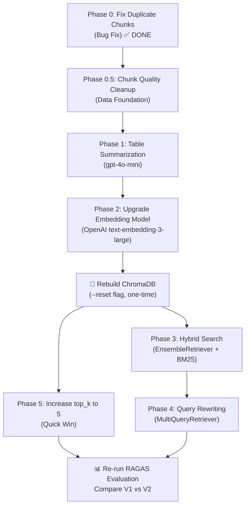

# MedTech RAG — V2 Implementation Plan

> **Branch:** `v2` (created from `master`)
> **Goal:** Dramatically improve retrieval accuracy and answer quality — especially for conversational, paraphrased, and table-based queries that V1 fails on.

---

## V1 Baseline — Where We Stand

From the RAGAS evaluation on 20 golden Q&A pairs, V1 shows a clear pattern:

| Query Type | V1 Performance |
|---|---|
| Direct keyword queries (`"calibration"`, `"fuse F1"`) | ✅ Works — Context Recall ≈ 1.0 |
| Specification lookups (`"timer range"`, `"power supply"`) | ✅ Works — Context Recall ≈ 1.0 |
| Table-based numerical queries (`"50 mA at 100 kVp"`) | ❌ Fails — retrieves wrong table |
| Conversational / paraphrased (`"Is the exposure setting right?"`) | ❌ Fails — Context Recall = 0.0 |
| Inferred questions (`"What is the output power?"`) | ❌ Fails — Context Recall = 0.0 |

**Also observed:** ChromaDB returns **duplicate chunks** (same content appearing as Chunk 1 and Chunk 2), wasting `top_k` slots. This is a data ingestion bug that must be fixed first.

---

## V2 Phases — Execution Order

The phases are ordered by **impact × ease**. Each phase is independent enough for a lower model to pick up and execute.

---

### Phase 0: Fix Duplicate Chunks in ChromaDB (Bug Fix) ✅ CODE DONE

**Problem:** The RAGAS results show identical chunks being returned in positions 1 and 2. This means the embedding pipeline inserted the same documents multiple times into ChromaDB.

**Action:**
1. Wipe the existing `data/chroma_db/` directory
2. Add deduplication logic in `embedding.py` before `add_documents()`
3. Re-run the embedding pipeline once

**Status:** Code changes to `embedding.py` are complete. Added `--reset` flag and deterministic document IDs via SHA-256 hashing. Will re-run after Phase 0.5 and Phase 1 so we only rebuild the database once.

**Effort:** ~30 minutes
**Impact:** Instantly doubles the effective `top_k` (you stop wasting half your retrieval slots on duplicates)

---

### Phase 0.5: Chunk Quality Cleanup (Data Foundation — Critical)

> [!IMPORTANT]
> This phase addresses fundamental data quality issues discovered during a full audit of all 52 V1 chunks (44 text + 8 table). The improvements here are foundational — every subsequent phase (better embeddings, hybrid search, etc.) will perform significantly better when operating on clean, well-structured chunks instead of noisy garbage.

**4 problems to fix:**

#### Problem 1: Garbage OCR / Diagram Noise Chunks

Several text chunks contain pure spatial layout artifacts from the PDF parser — diagram labels, circuit schematics, and control panel layouts that were OCR'd as text. These have **zero semantic value** and actively pollute the vector space.

**Worst offenders identified:**

| Chunk # | Content | Why it's garbage |
|---|---|---|
| Chunk 3 | `"18\n\n16\n\n15\n8  9\n\n14\n10\n13\n12"` | Diagram label positions — just numbers |
| Chunk 6 (partial) | `"A    040 002 50 L K4 VER    B"` | Control panel spatial layout |
| Chunk 20 | `"SSR  MA KVP VOL.  1RE1ON/OFF 12V/12A  A6..."` | Full wiring diagram as text — completely unusable |
| Chunk 2 (partial) | `"1. Column Cover ... 5. Tube Head"` with random positions | Parts list as spatial diagram |

**Action:** Add a noise filtering step in `preprocessing.py` that either:
- Identifies and removes pages/sections that are known diagrams/schematics (manual exclusion list, similar to the Page 11 approach already used for fake tables)
- Or applies a heuristic: if a text block has a very high ratio of numbers/special-chars to actual words, flag it as noise

**Files to modify:** `src/preprocessing.py`

---

#### Problem 2: Naive Fixed-Size Chunking

The Allengers 100 manual is a dense technical reference with highly structured headers. Currently, it uses a fixed `chunk_size=2000`, which arbitrarily chops the text, frequently mixing 3–5 **completely unrelated topics** into a single chunk.

**Real example — V1 Chunk 8 contains all of these in one chunk:**
1. Hand Switch description
2. Fuse safety table (F1–F4 ratings)
3. LBD light switch info
4. Power Supply Requirements (voltage, frequency, current)
5. Earthing requirements
6. Environmental Conditions (temperature, humidity)

When a user asks *"What is the rating of fuse F1?"*, this chunk gets retrieved, but the fuse info is buried in a wall of unrelated text. The embedding vector represents the *average* of 5 topics.

**Action:** Switch to **Structural (Markdown) Chunking** in `src/chunking.py`:
- Replace `RecursiveCharacterTextSplitter` with LangChain's `MarkdownHeaderTextSplitter` (or a custom regex equivalent).
- Split the text at structural boundaries like `1.1 INTRODUCTION` and `1.5 POWER SUPPLY REQUIREMENTS`.
- This ensures that 1 chunk = 1 cohesive topic, regardless of character length.

**Files to modify:** `src/chunking.py`

---

#### Problem 3: No Metadata (Page Numbers / Section Headers)

Every text chunk carries only `{"source": "unstructured_text", "chunk_index": 0}`. There is:
- No **page number** — can't tell the user where the answer is from
- No **section header** — can't filter searches to "Calibration" or "Installation"
- No way to **debug** which parts of the manual are being retrieved

Table chunks have page numbers embedded in their text (`Source: Page 35`), which is good, but it's not in the metadata where it can be used for filtering.

**Action:** Enrich chunk metadata during the chunking phase:
- Extract section headers (e.g., `"7. CALIBRATION AND TESTING"`) from the text and attach as `metadata.section`
- Track approximate page numbers and attach as `metadata.page`
- For table chunks, also add `metadata.page` from the existing header text

**Files to modify:** `src/chunking.py`, `src/embedding.py` (pass metadata through to Documents)

---

#### Problem 4: Unintentional Content Duplication (Text ↔ Table)

The same factual tabular data exists in **both** text chunks and table chunks because:
1. `clean_text.txt` contains flattened table data embedded in surrounding prose (the V1 decision for context fallback)
2. `processed_tables.md` contains the same tables as standalone markdown

This was a *deliberate* V1 trade-off, but combined with the duplicate insertion bug, some facts appeared 3–4x in ChromaDB.

**Action:** Now that we're adding table summarization (Phase 1), the text-embedded fallback is no longer needed. The generated summary gives the embedding model perfect context. We should:
- **Completely strip** the flattened tables out of `clean_text.txt` during preprocessing (or replace them with a simple `[Refer to Table X]` placeholder).
- Rely purely on the `summary + raw table` chunks for tabular data.
- This guarantees zero duplication and an extremely clean vector space.

**Files to modify:** `src/preprocessing.py`, `src/chunking.py`

---

#### Phase 0.5 Summary

| Sub-task | Priority | Effort | Impact |
|---|---|---|---|
| Filter garbage/noise chunks | 🔴 Critical | ~1 hour | Removes junk from vector space |
| Reduce chunk size (2000→1000) | 🔴 Critical | ~10 min | Sharper, more focused embeddings |
| Add metadata (page, section) | 🟡 Important | ~1 hour | Better debugging, future filtering |
| Address text↔table duplication | 🟢 Nice-to-have | ~30 min | Cleaner data, less noise |

---

### Phase 1: Table Summarization (Metadata Enrichment)

> [!IMPORTANT]
> This is the single highest-impact change. Tables are currently invisible to semantic search.

**Problem:** Table chunks like `"50 | 100 | 115 mAs"` have no natural language for the embedding model to understand. A user asking *"What is the correct mAs at 50 mA and 100 kVp?"* will never match this chunk semantically.

**Solution:** Use an LLM to generate a natural-language summary for each table during preprocessing, then store `summary + raw table` as the chunk.

**Example — Before vs After:**

```
BEFORE (V1 chunk):
### Data Table - Source: Page 35
| mA | KVP | mAs |
|---|---|---|
| 50 | 100 | 115 mAs |
| 100 | 80 | 15 mAs. |
| 100 | 60 | 85 mAs |

AFTER (V2 chunk):
SUMMARY: This table shows the overload test calibration parameters for the
Allengers 100 X-Ray generator. It lists the correct mAs (milliampere-seconds)
output values for different combinations of mA stations and kVp settings.
For example, at 50 mA and 100 kVp, the correct mAs reading should be 115.

### Data Table - Source: Page 35
| mA | KVP | mAs |
|---|---|---|
| 50 | 100 | 115 mAs |
| 100 | 80 | 15 mAs. |
| 100 | 60 | 85 mAs |
```

**Files to modify:** `src/preprocessing.py` (add `summarize_table()` function)

**✅ Decision: Use `gpt-4o-mini`** — ~$0.01 for all 8 tables, already wired up in `llm.py`.

---

### Phase 2: Upgrade Embedding Model

**Problem:** `all-MiniLM-L6-v2` is a 22MB micro-model (384 dimensions). It's good at keyword proximity but terrible at bridging the semantic gap between conversational questions and technical content.

**Action:** Swap the default embedding model in `embedding.py`.

**✅ Decision: Primary = OpenAI `text-embedding-3-large`, Fallback = local HuggingFace**

- Primary (`openai`): Best quality, ~$0.02 one-time to embed all chunks, per-query cost is negligible (~30,000 queries per penny)
- Fallback (`huggingface`): Keeps the project runnable without an API key for anyone cloning the repo

**Files to modify:** `src/embedding.py` (add `text-embedding-3-large` option, set as new default)

---

### Phase 3: Hybrid Search (BM25 + Semantic)

**Problem:** Pure semantic search fails on exact numerical lookups. When a user types `"50 mA 80 kVp"`, the embedding model may not rank the matching table row highest. BM25 (keyword search) would instantly find `"50"` and `"80"` as exact token matches.

**Solution:** Run both searches in parallel, merge the results, and re-rank.

**Architecture:**

```
User Query
    │
    ├──→ ChromaDB (Semantic Search) → Top K results
    │
    ├──→ BM25 (Keyword Search) → Top K results
    │
    └──→ Reciprocal Rank Fusion (RRF) → Merged & Re-ranked → Final Top K
```

**✅ Decision: LangChain `EnsembleRetriever`** — handles RRF automatically, configurable weights (e.g., 50% semantic / 50% keyword), ~20 lines of code.

**Files to modify:** `src/api.py` (replace `similarity_search` with `EnsembleRetriever`)

---

### Phase 4: Query Rewriting (Multi-Query Expansion)

**Problem:** A single user query phrased one way may miss relevant chunks. Example: *"Is the exposure setting right for medium current?"* — this never mentions `mA`, `kVp`, or any technical term.

**Solution:** Before searching, pass the user query through a fast LLM call to generate 3 search-optimized variants. Run all 3 searches, deduplicate, and return the union.

**Example:**

```
Original: "Is the exposure setting right for medium current?"

Rewritten variants:
1. "50 mA exposure mAs calibration setting"
2. "correct mAs value for 50 milliampere X-ray"
3. "Allengers 100 medium current exposure parameters table"
```

**✅ Decision: LangChain `MultiQueryRetriever`** — built-in, handles deduplication automatically, ~10 lines of code.

**Files to modify:** `src/api.py`

---

### Phase 5: Increase `top_k` + Add Score Threshold

**Problem:** `top_k=3` is too restrictive. The correct chunk often scores 4th or 5th.

**Action:**
1. Change default `top_k` from 3 to **5**
2. Add a minimum relevance score threshold to filter out low-confidence junk chunks
3. Update `schemas.py` to make `top_k` a parameter with the new default

**✅ Decision: `top_k=5`** — good balance after the other improvements.

**Effort:** ~15 minutes
**Impact:** Medium — works best in combination with the other phases

**Files to modify:** `src/schemas.py`, `src/api.py`

---

## Execution Order Summary



> [!NOTE]
> We only rebuild ChromaDB **once** — after Phases 0, 0.5, 1, and 2 are all complete. This saves time and cost since embedding is a one-time operation.

---

## Files That Will Be Modified

| File | Phases | Changes |
|---|---|---|
| `src/preprocessing.py` | 0.5, 1 | Noise filtering + `summarize_table()` using LLM |
| `src/chunking.py` | 0.5 | Reduce chunk size, add metadata extraction (page, section) |
| `src/embedding.py` | 0, 2 | Dedup logic (✅ done) + OpenAI embedding model option |
| `src/api.py` | 3, 4 | Replace `similarity_search` with `EnsembleRetriever` + `MultiQueryRetriever` |
| `src/schemas.py` | 5 | Update default `top_k` to 5 |
| `src/llm.py` | 1, 4 | May add a lightweight summarization model config |
| `DEV_LOG.md` | All | Document every decision |

---

## Decisions — Final Summary

All decision points have been resolved:

| Phase | Decision | Choice |
|---|---|---|
| Phase 1 — Table Summarization LLM | `gpt-4o-mini` | ~$0.01 total, already set up |
| Phase 2 — Embedding Model | OpenAI `text-embedding-3-large` (primary) + HuggingFace (fallback) | Best quality + graceful degradation |
| Phase 3 — Hybrid Search | LangChain `EnsembleRetriever` | Auto RRF, ~20 lines |
| Phase 4 — Query Rewriting | LangChain `MultiQueryRetriever` | Auto dedup, ~10 lines |
| Phase 5 — top_k | `5` | Good balance |

---

## Next Step

Phase 0 code is done. **Phase 0.5 is next** — begin with the chunk quality cleanup before touching anything else.
